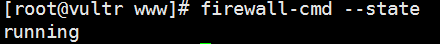
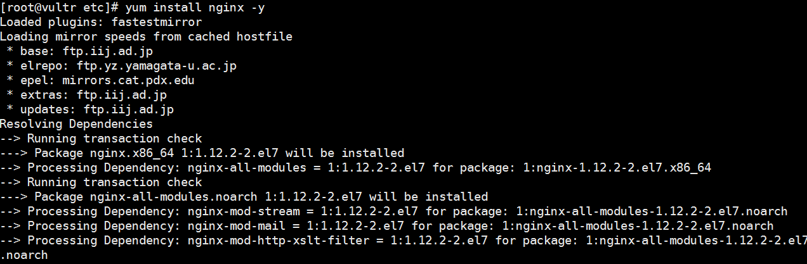
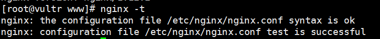

### Centos+nginx  搭建网站

Nginx (engine x) 是一个高性能的HTTP和反向代理服务，也是一个IMAP/POP3/SMTP服务。Nginx是由伊戈尔·赛索耶夫为俄罗斯访问量第二的Rambler.ru站点（俄文：Рамблер）开发的，第一个公开版本0.1.0发布于2004年10月4日。
<!--more-->

### 搭建简易教程
    Centos服务器配置
    nginx配置
    网站发布

## **0x00 Centos服务器配置**   </b>

#### 搭建Centos 服务器
可以在虚拟机中搭建一个Centos 服务器或者去阿里或其他地方购买。有了服务器之后可以就可以干很多事情了。搭建过程就不详细说明了。


#### 配置Centos防火墙
然后就是启动服务器查看配置了，首先看服务器防火墙版本号
```
firewall-cmd --version
```
查看防火墙状态
firewall-cmd --state


添加80端口的权限
```
firewall-cmd --zone=public --add-port=80/tcp --permanent
命令含义：
--zone #作用域
--add-port=80/tcp #添加端口，格式为：端口/通讯协议
--permanent #永久生效，没有此参数重启后失效
```
重启防火墙
```
systemctl restart firewalld
```

扩展点Centos的的知识吧
```
firewalld的命令
运行、停止、禁用firewalld
启动：# systemctl start firewalld
重启：# systemctl restart firewalld
查看状态：# systemctl status firewalld 或者 firewall-cmd --state
停止：# systemctl disable firewalld
禁用：# systemctl stop firewalld
配置firewalld
查看版本：$ firewall-cmd --version
查看帮助：$ firewall-cmd --help
显示状态：$ firewall-cmd --state
查看区域信息: $ firewall-cmd --get-active-zones
查看指定接口所属区域：$ firewall-cmd --get-zone-of-interface=eth0
拒绝所有包：# firewall-cmd --panic-on
取消拒绝状态：# firewall-cmd --panic-off
查看是否拒绝：$ firewall-cmd --query-panic
更新防火墙规则：
# firewall-cmd --reload
# firewall-cmd --complete-reload
两者的区别就是第一个无需断开连接，就是firewalld特性之一动态添加规则，第二个需要断开连接，类似重启服务
将接口添加到区域，默认接口都在public
# firewall-cmd --zone=public --add-interface=eth0
永久生效再加上 --permanent 然后reload防火墙
设置默认接口区域
# firewall-cmd --set-default-zone=public
立即生效无需重启
打开端口（貌似这个才最常用）
查看所有打开的端口：
# firewall-cmd --zone=dmz --list-ports
加入一个端口到区域：
# firewall-cmd --zone=dmz --add-port=8080/tcp
若要永久生效方法同上
打开一个服务，类似于将端口可视化，服务需要在配置文件中添加，/etc/firewalld 目录下有services文件夹，这个不详细说了，详情参考文档
# firewall-cmd --zone=work --add-service=smtp
移除服务
# firewall-cmd --zone=work --remove-service=smtp

作者：轩轩他爸
链接：https://www.jianshu.com/p/6ac0a9afa080
來源：简书
简书著作权归作者所有，任何形式的转载都请联系作者获得授权并注明出处。
```
开启了http  80默认端口之后就可以继续接下来的事情了


## **0x01  nginx安装配置**  </b>

#### 安装nginx
```
yum install nginx -y   //安装nginx  -y是默认接下来的指示一直是y
```

 安装完成后看是否安装成功
```
nginx -v
```


ok成功安装

也可以卸载重装
```
yum remove nginx -y    //卸载nginx
```

直接配置nginx,nginx的配置文件的安装目录放在/etc/nginx/nginx.conf 下
#### 如果你不确定路径的话也可以查看配置文件路径
```
nginx -t
```


打开配置文件
```
vim /etc/nginx/nginx.conf    //在根目录下打开
vim /nginx.conf              //在nginx目录下打开
```
主要就是把root /usr/share/nginx/html; 修改为: root /data/www; 其他也不用配置

```
user nginx;
worker_processes auto;
error_log /var/log/nginx/error.log;
pid /run/nginx.pid;

include /usr/share/nginx/modules/*.conf;

events {
    worker_connections 1024;
}

http {
    log_format  main  '$remote_addr - $remote_user [$time_local] "$request" '
                      '$status $body_bytes_sent "$http_referer" '
                      '"$http_user_agent" "$http_x_forwarded_for"';

    access_log  /var/log/nginx/access.log  main;

    sendfile            on;
    tcp_nopush          on;
    tcp_nodelay         on;
    keepalive_timeout   65;
    types_hash_max_size 2048;

    include             /etc/nginx/mime.types;
    default_type        application/octet-stream;

    include /etc/nginx/conf.d/*.conf;

    server {
        listen       80 default_server;
        listen       [::]:80 default_server;
        server_name  _;
        root         /data/www;

        include /etc/nginx/default.d/*.conf;

        location / {
        }

        error_page 404 /404.html;
            location = /40x.html {
        }

        error_page 500 502 503 504 /50x.html;
            location = /50x.html {
        }
    }

}
```

重启nginx 
```
nginx -s reload
```

重启后就就是创建我们刚的配置文件/data/www
```
mkdir -p /data/www
```
#### 扩展nginx配置知识
```./nginx  #打开 nginx
nginx -s reload|reopen|stop|quit  #重新加载配置|重启|停止|退出 nginx
nginx -t   #测试配置是否有语法错误

nginx [-?hvVtq] [-s signal] [-c filename] [-p prefix] [-g directives]

-?,-h           : 打开帮助信息
-v              : 显示版本信息并退出
-V              : 显示版本和配置选项信息，然后退出
-t              : 检测配置文件是否有语法错误，然后退出
-q              : 在检测配置文件期间屏蔽非错误信息
-s signal       : 给一个 nginx 主进程发送信号：stop（停止）, quit（退出）, reopen（重启）, reload（重新加载配置文件）
-p prefix       : 设置前缀路径（默认是：/usr/local/nginx/）
-c filename     : 设置配置文件（默认是：/usr/local/nginx/conf/nginx.conf）
-g directives   : 设置配置文件外的全局指令


查看进程号：
$ ps -ef|grep nginx
root      5747     1  0 May23 ?        00:00:00 nginx: master process /usr/local/nginx/sbin/nginx
500      12037  7886  0 10:00 pts/1    00:00:00 grep nginx
nobody   25581  5747  0 Sep27 ?        00:01:16 nginx: worker process      
nobody   25582  5747  0 Sep27 ?        00:01:25 nginx: worker process      
nobody   25583  5747  0 Sep27 ?        00:02:59 nginx: worker process      
nobody   25584  5747  0 Sep27 ?        00:02:05 nginx: worker process


杀死进程：
$ kill -9 5747


```

## **0x02  网站发布**  </b>
可以选择xftps链接到服务器，然后将网站的目录上场到/data/www目录下


接下来就是直接访问公网ip


ok成功完成网站的部署过程

接下来我就要写Bootstrap的实战教程了


