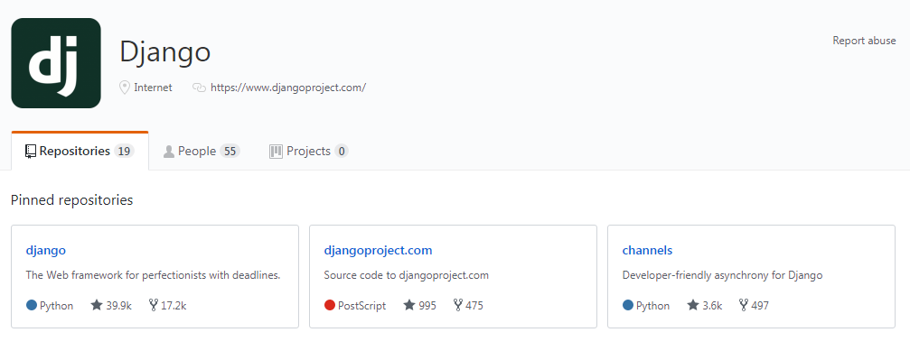

<!--more-->
### Django 介绍
Django的一款web框架，他是大而全的，他最让人称赞的地方就是他的智能后台管理系统。优秀的ORM，你再也不用折磨的写sql语句了，很多时候，你仅仅只需要写上那么几行主要的逻辑语句，就完成了一个网站。但是框架这东西也是能者见仁，智者见智。他对并发量的解决能力比较差，比较Tornado，还有很大差距。


### Django 中的setting介绍

#### app路径
```
INSTALLED_APPS = [
    'django.contrib.admin',
    'django.contrib.auth',
    'django.contrib.contenttypes',
    'django.contrib.sessions',
    'django.contrib.messages',
    'django.contrib.staticfiles',

    # 默认已有，如果没有只要添加app名称即可，例如：'app'
    # 新建的应用都要在这里添加
    'users',

]
```

### 数据库配置

```
如果我们不适用django的默认sqlite3，那么我们就不用改
DATABASES = {       
 'default': {
 'ENGINE': 'django.db.backends.sqlite3',
 'NAME': os.path.join(BASE_DIR, 'db.sqlite3'),
 }
}
```

像我一般使用mysql，则需要将数据库注释，进行修改

```

DATABASES = {
    'default': {
        'ENGINE': 'django.db.backends.mysql',
        'NAME': '',          # 你的数据库名称，数据库需要提前建好
        'USER': '',          # 你的数据库用户名
        'PASSWORD': '',      # 你的数据库密码
        'HOST':'',           # 你的数据库主机，默认localhost,你写127.0.0.1也行
        'PORT': '',          # 你的数据库端口

    },

}
```


建完之后，记得下载mysql的数据库驱动，我们需要在__init__.py 文件中添加
```
import pymysql
pymysql.install_as_MySQLdb()
```


### 邮件设置

```
EMAIL_HOST = "smtp.sina.com"   # 邮件域名
EMAIL_PORT = 25                # 邮件开放的端口，不同邮箱端口开放不同，他家会说明
EMAIL_HOST_USER = ""           # 你的邮箱账号
EMAIL_HOST_PASSWORD = ""       # 你的邮箱密码
EMAIL_USE_TLS = False          # 这里是 False
EMAIL_FROM = ""                # 你的邮箱账号
```


### 静态文件目录

这样声明，我们就能在static文件夹下放入我们的css,js文件
```
单级目录静态文件
STATICFILES_DIRS=(
    os.path.join(BASE_DIR,"statics"),
)
多级目录静态文件
STATIC_URL = '/static/'
STATICFILES_DIRS = (
    os.path.join(BASE_DIR, "static", "blog"),
)
```
这样我们静态文件导入就可以这样了
```


```


### 文件上传路径

很多时候我们需要设置文件上传的路径时，可以这样设置，将用户上传的静态文件放到这个目录中
```
MEDIA_URL = '/media/'
MEDIA_ROOT = os.path.join(BASE_DIR, 'media')
```

### 中间件

这个我也没多大写过，但是我知道中间件是及其重要的，这里的中间件一般都是应对安全的，这个在我之前说过，比如csrf,xss等等。。其实Scrapy中也有，他有两个最重要的
中间件Spider Middlewares，Downloader Middlewares。基本我们在筛选，爬虫的代理等都可以在中间件中进行，你想啊，他反正需要从我这过，数据都是先过我的。
```
MIDDLEWARE_CLASSES = [
    'django.middleware.security.SecurityMiddleware',
    'django.contrib.sessions.middleware.SessionMiddleware',
    'django.middleware.common.CommonMiddleware',
    'django.middleware.csrf.CsrfViewMiddleware',
    'django.contrib.auth.middleware.AuthenticationMiddleware',
    'django.contrib.auth.middleware.SessionAuthenticationMiddleware',
    'django.contrib.messages.middleware.MessageMiddleware',
    'django.middleware.clickjacking.XFrameOptionsMiddleware',
]
```

### session存储的相关配置

你想啊，cookie负责客户端，session负责服务端，太重要了
Django默认支持Session的，并且默认是将Session数据存储在数据库中，即django_session表中
```
 SESSION_ENGINE = 'django.contrib.sessions.backends.db' # 引擎（默认）
 SESSION_COOKIE_NAME ＝ "sessionid"   # Session的cookie保存在浏览器上时的key，即：sessionid＝随机字符串（默认）
 SESSION_COOKIE_PATH ＝ "/"    # Session的cookie保存的路径（默认）
 SESSION_COOKIE_DOMAIN = None    # Session的cookie保存的域名（默认）
 SESSION_COOKIE_SECURE = False    # 是否Https传输cookie（默认）
 SESSION_COOKIE_HTTPONLY = True    # 是否Session的cookie只支持http传输（默认）
 SESSION_COOKIE_AGE = 1209600    # Session的cookie失效日期（2周）（默认）
 SESSION_EXPIRE_AT_BROWSER_CLOSE = False   # 是否关闭浏览器使得Session过期（默认）
 SESSION_SAVE_EVERY_REQUEST = False   # 是否每次请求都保存Session，默认修改之后才保存（默认）
```

### 语言/时区

```
LANGUAGE_CODE = 'zh-cn'
# 时区
TIME_ZONE = 'Asia/Shanghai'
USE_TZ = True
```

### 模板（HTML）路径相关配置

```
TEMPLATES = [
    {
        'BACKEND': 'django.template.backends.django.DjangoTemplates',
        'DIRS': [os.path.join(BASE_DIR, 'templates')]
        ,
        'APP_DIRS': True,
        'OPTIONS': {
            'context_processors': [
                'django.template.context_processors.debug',
                'django.template.context_processors.request',
                'django.contrib.auth.context_processors.auth',
                'django.contrib.messages.context_processors.messages',
                # 添加图片处理器，为了在课程机构列表中前面加上MEDIA_URL
                'django.core.context_processors.media',
            ],
        },
    },
]
```

### 认证相关

```
AUTH_PASSWORD_VALIDATORS = [
    {
        'NAME': 'django.contrib.auth.password_validation.UserAttributeSimilarityValidator',
    },
    {
        'NAME': 'django.contrib.auth.password_validation.MinimumLengthValidator',
    },
    {
        'NAME': 'django.contrib.auth.password_validation.CommonPasswordValidator',
    },
    {
        'NAME': 'django.contrib.auth.password_validation.NumericPasswordValidator',
    },
]

```

### TEMPLATE_DEBUG

同样是一个DEBUG开关,若为True,DEBUG信息在触发异常之后,会显示在网页上.上线之前必须修改成:
- TEMPLATE_DEBUG = False


[参考链接](https://segmentfault.com/a/1190000003756582)

