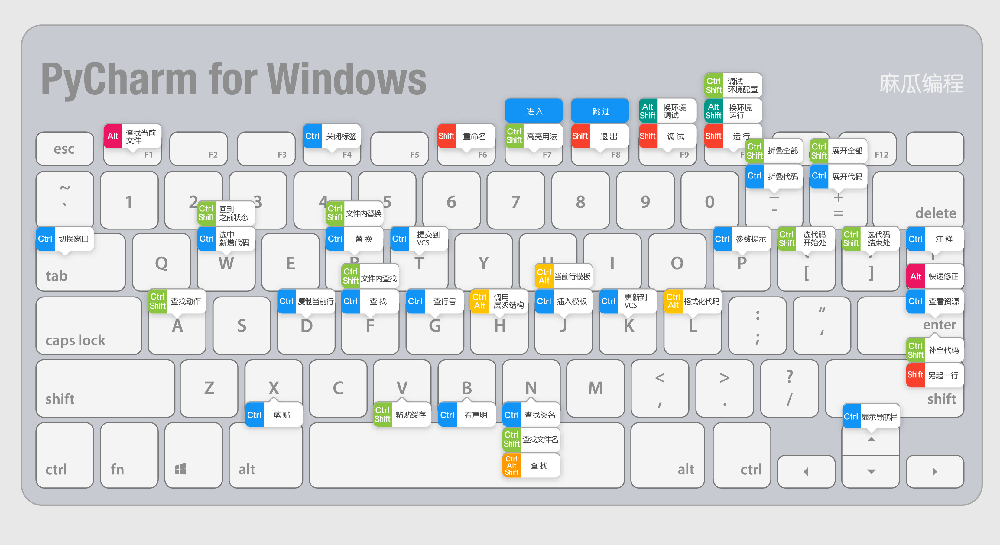
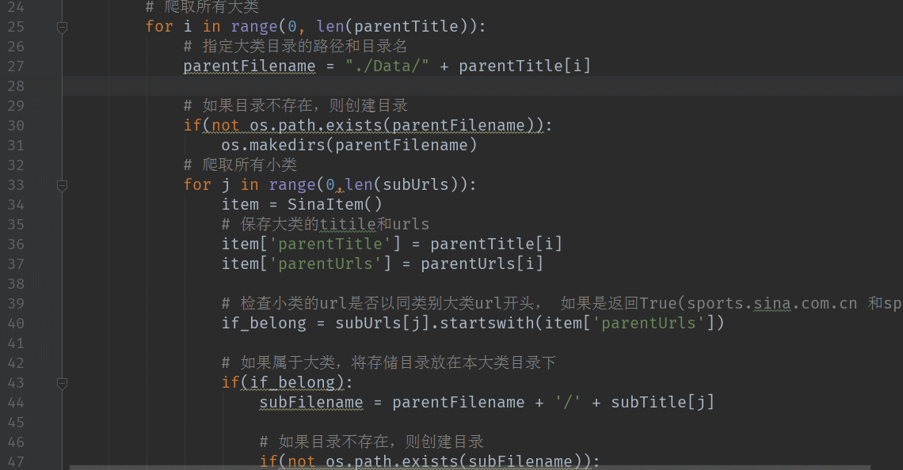
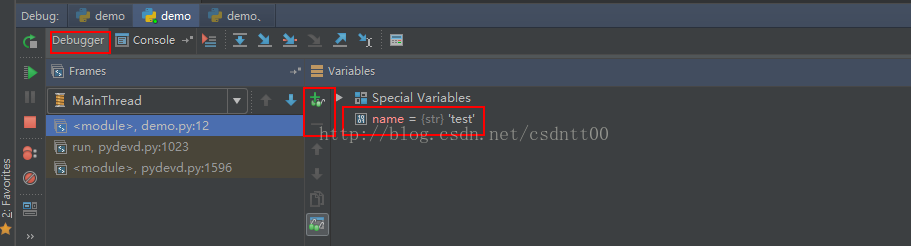

<!--more-->

### 前言
我们都知道Python有很多技巧使用，下面我们来聊聊我们经常使用的一些方法。

### 快捷键使用
> 普通操作
    
    ctrl+鼠标左键                  
    # 可以直接查找这个函数或类等，在实际代码中非常有用

    ctrl+F4
    # 可以关掉目前的标签页，但是不经常用啊，手哪有这么长

    ctrl+F
    # 这个挺有用的，查找什么的，直接用这个快捷键，查找这个文件下的东西

    ctrl + 向上箭头
    # 这个是调整视角用的，光标不变，但是视角会让你视角向上

    

    ctrl + 向下箭头
    # 和上面的向上箭头刚好相反。

    ctrl + /
    # 注释和反注释代码

    F1 
    # 直接网页查找源代码解释

    ALT + F1
    # 直接查找当前文件

    双击shift
    # 这个真的神器，直接查找本项目的所有东西，什么文件夹，文件，类等都可以查

    Alt+1 
    # 显示左侧工程栏,和那个vscode的ctrl + B 是一样的

    Ctrl + R            
    # 替换 

    Ctrl + Shift + F  
    # 全局查找 

    Ctrl + Shift + R  
    # 全局替换 

    什么全选，粘贴，复制都是和平时快捷键一样

> 调试操作

我们都知道，调试在程序修改和程序运行时都是非常有用的，那么我们来讲下调试技巧

F9：进入调试模式选择框，可以选择进行调试的脚本（）

F8：一直往下一步走，每次跳一步，遇到调用方法（函数）时，直接返回函数结果，仍然继续往下

F7：一直往下一步走，当遇到调用方法（函数）时，跳到该方法（函数）位置，执行完函数后再回到原来位置继续往下走
Shift + F9：直接进入Debugger模式，在Debugger中的Variables中可以查看步骤执行之后的变量值，想要查看没有显示的变量值，可以通过“+”号添加，或者“-”号移除

