* 容器属性
* 条目属性

<!--more-->
### flex布局弹性布局初探
### 容器属性
* 容器属性指的就是一个容器中元素的属性排列方式
* display:flex         --声明使用弹性盒布局
* flex-direction:row|row-reverse|column|column-reseme
    
    * 确定子元素的排列方式

    * 参数解释row 横排列
    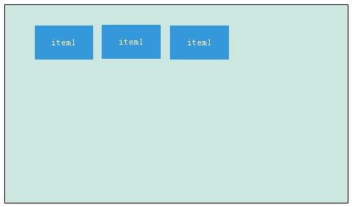
    * 参数解释row-reverse排列
    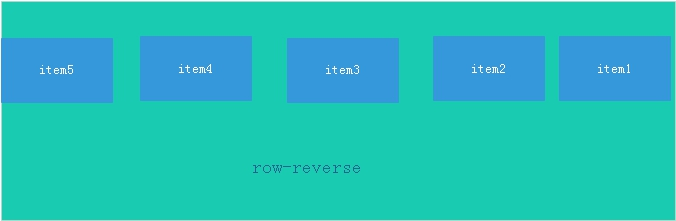
    * 参数解释column排列
    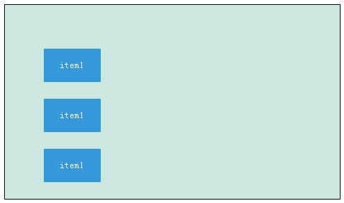
    * 参数解释column-reverse排列
    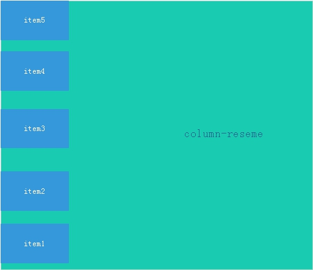

*  flex-flow:flex-firection|flex-wrap
    * 确定子元素的排列方式和是否换行
    * 参数解释 flex-direction 就是第一点那几个参数row|row-reverse|column|column-reseme
    * 参数解释 flex-wrap 有wrap| wrap-reverse 换行|不换行

*  justify-content:flex-start|flex-end|Center|space-between|space-around
决定item在主轴上的对齐方式，flex-start|flex-end|Center|space-between|space-around当主轴沿水平方向时
    * 参数解释 flex-start  靠左排列
    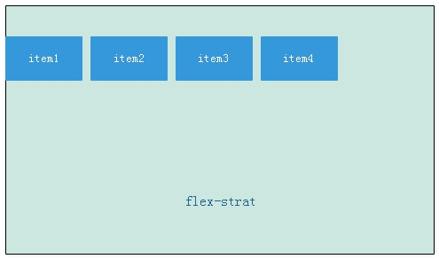
    * 参数解释 center  居中排列
    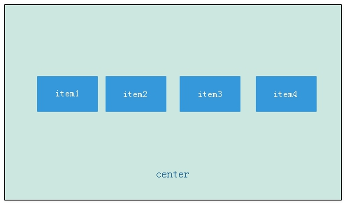
    * 参数解释 flex-end  靠右排列
    )
    * 参数解释  space-between 两端对齐
    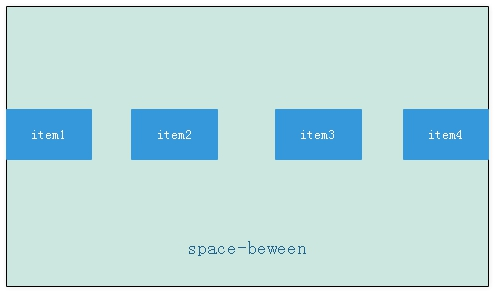
    * 参数解释  space-around 沿轴线均与分布
    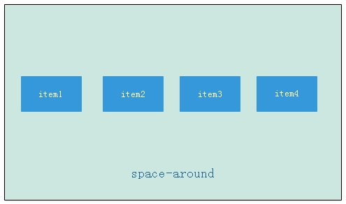

* align-items:flex-start|flex-end|cneter|baseline|strech
决定了item 在交叉轴的对齐方式，可能的值有flex-start|flex-end|cneter|baseline|strech 当主轴水平时，其具体含义为
    * 参数解释 flex-start  顶端对齐
    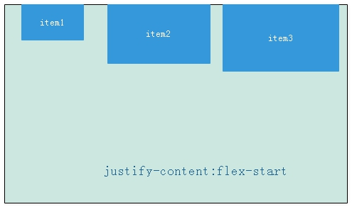
    * 参数解释 cneter  竖直方向上居中对齐
    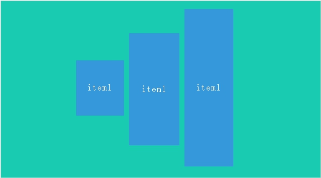
    * 参数解释 flex-end  竖直方向上底部对齐
    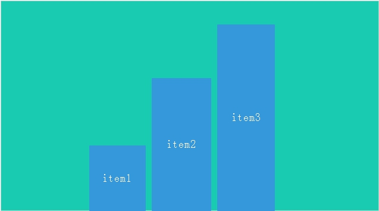
    * 参数解释 baseline li第一行文字的底部对齐
     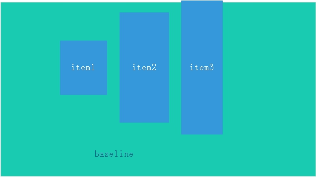
    * 参数 stretch 当item未设置高度时，item将和容器等高对齐
    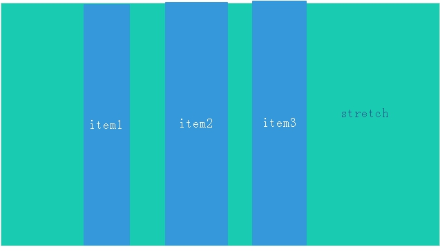

* align-content:flex-start|flex-end|center|space-beween|space-around|stretch
就是说该属性定义了当有多根主轴时，即item有多行时，多行在交叉轴轴上的对齐方式，注意当有多行时，定义了align-content后，align-item属性将失效，align-content的属性含义如下
    * flex-start :左对齐
    * flex-end: 右对齐
    * center:居中对齐
    * space-around:沿轴线均匀分布
    * stretch:各行将根据其flex-grow值伸展以充分占据剩余空间

### 条目属性
条目属性就是子元素的属性，不是在父元素中设置，而是直接在子元素上直接设置class.
* flex-grow:number 参数number是数字，当父元素的空间不足时，各个子元素的尺寸可以设置分配比例，默认值为0；即就是当有多余的尺寸也不放大
* flex-shrink:number等  默认值为1，表示当空间不足时自动缩小，number表示整数，表示不同item的缩小比例
* flex-basis:px/rem  px/rem表示各种像素等          表示项目在主轴占据的空间，默认值为auto,
* flex 的属性时flex-grow,flex-shrink和flex-basis的简称总和
* align-self:auto|flex-start|flex-end|center|baseline|stretch    表示允许单独的item有自己独特的对齐方式
    * auto 默认值，和父元素所规定的一样
    * flex-start 顶端对齐
    * flex-end   底部对齐
    * cneter     竖直方向上居中对齐
    * baseline   item第一行文字的底部对齐
    * stretch  当item为设置高度时，item将和容器等高对齐
    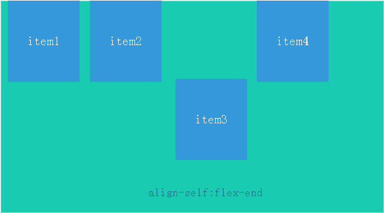

