<!--more-->

### 简介
```
1、这次使用的是pycharm 2018.2
2、在使用pycharm 的时候经常需要使用git操作，然后进行使用github、gitlab等进行协同操作
```


### **0x00 pycharm 基本配置**

#### github 账号登录
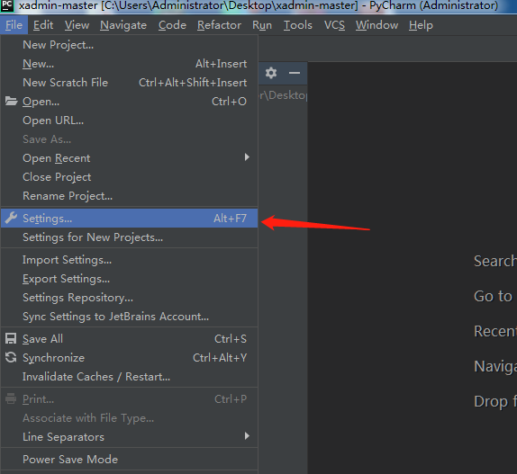

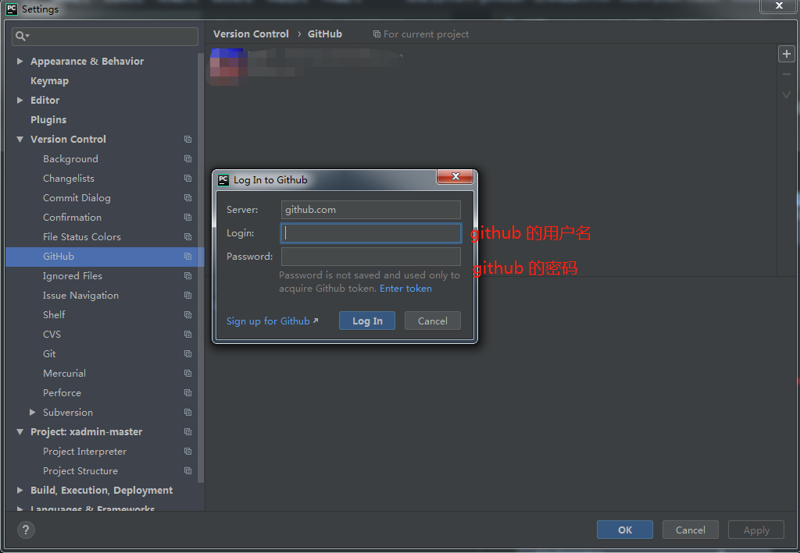


#### git 配置登录
首先你git与github配置好了，git能正常上传到github上。
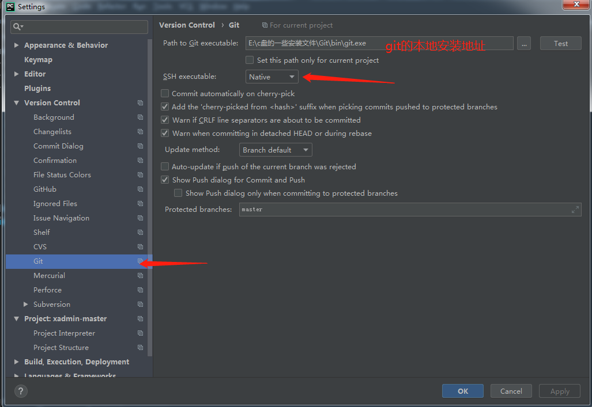


### **0x01 pycharm 下的git常规操作**

#### 分享到github上去
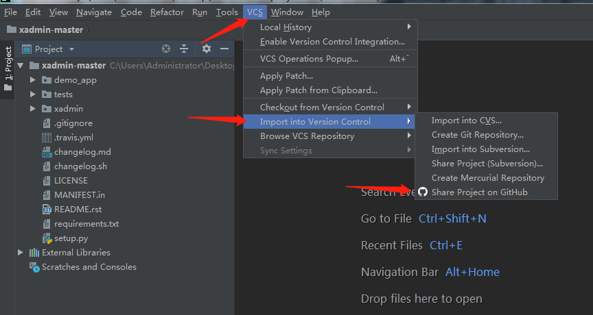
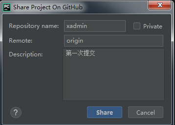
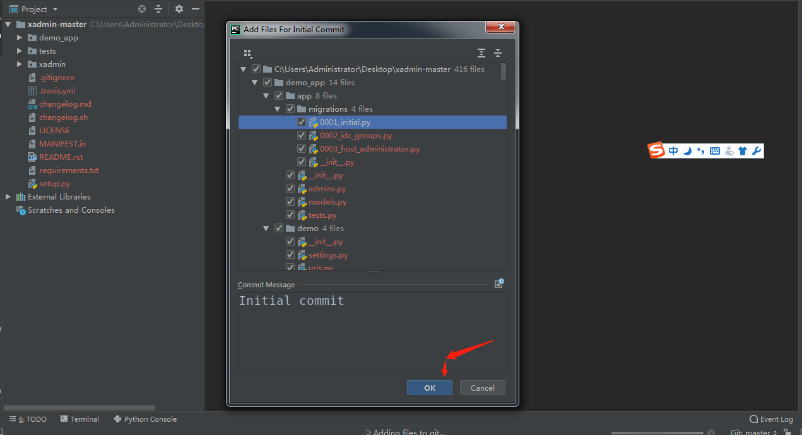

```
提交成功
```

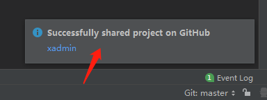


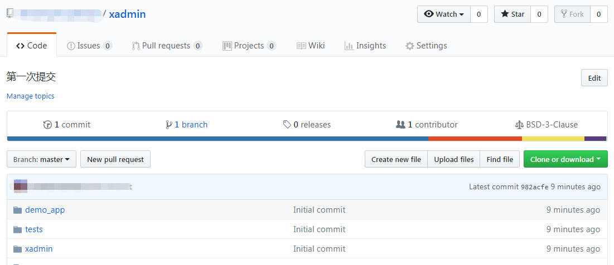


#### 创建分支，提交分支
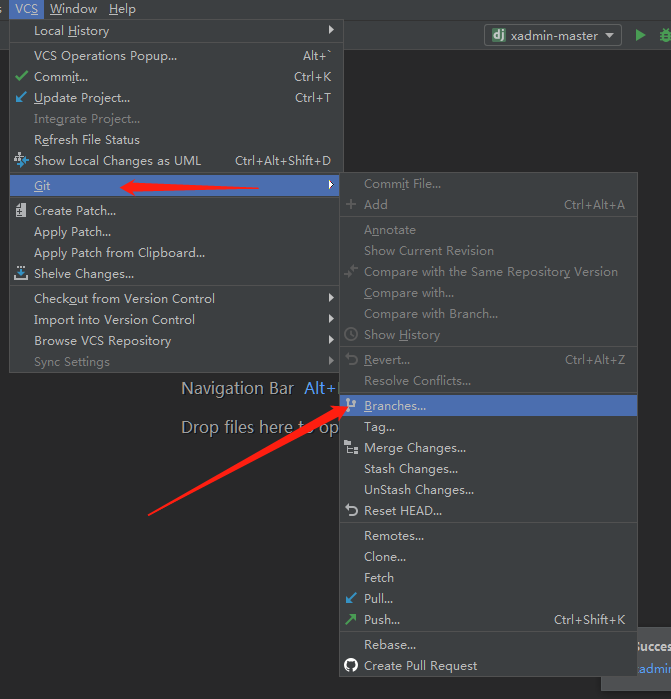
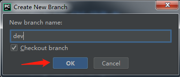
```
本地分支创建完成
```


```
远程分支提交
```

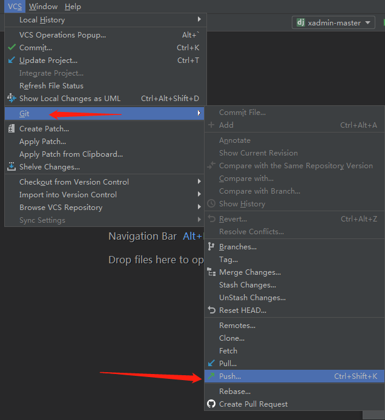

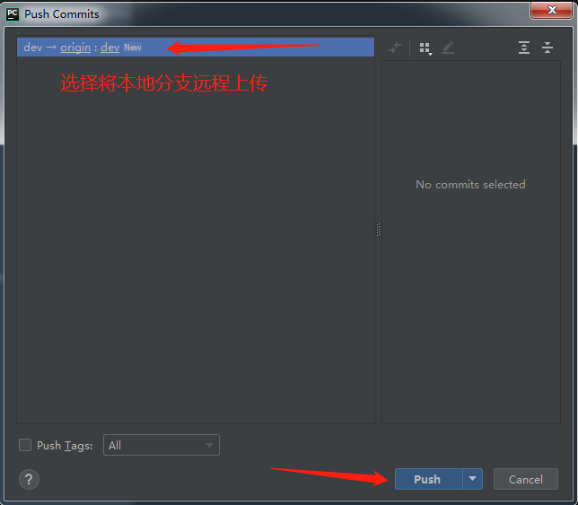

```
提交成功
```

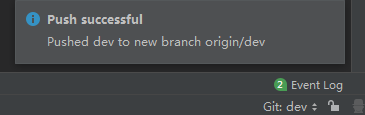
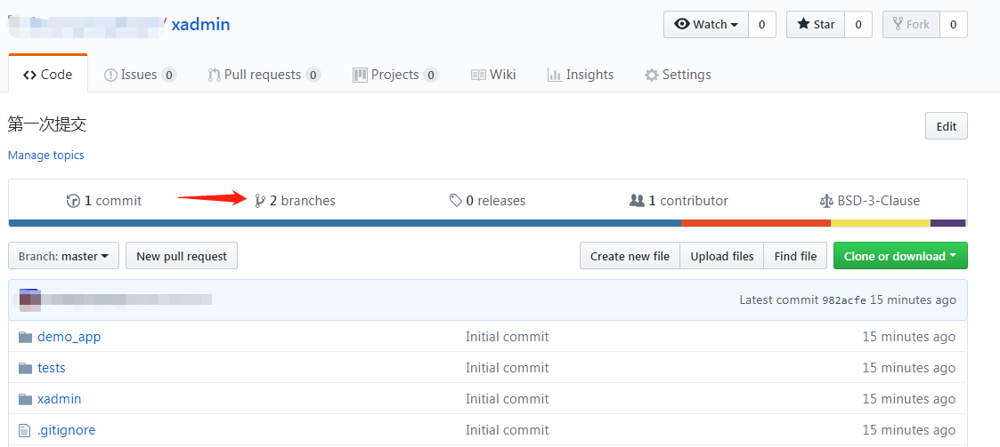

#### 版本代码回滚

比如我第二次提交了代码
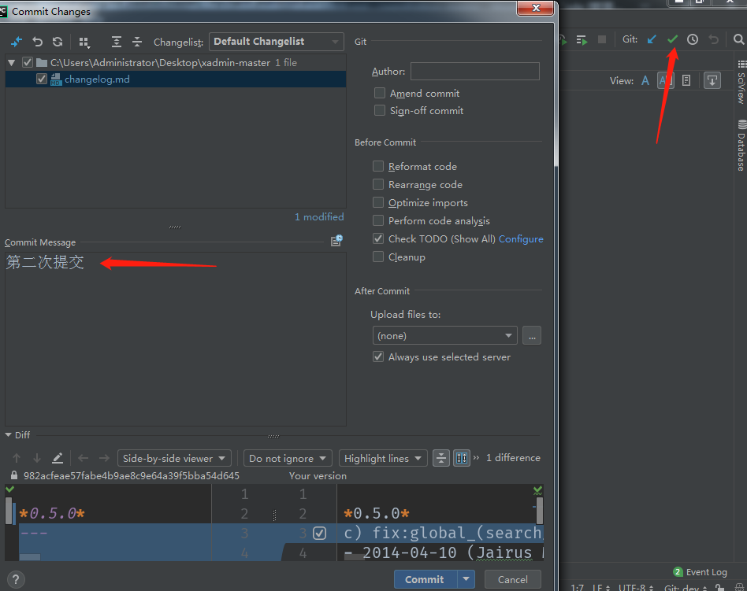
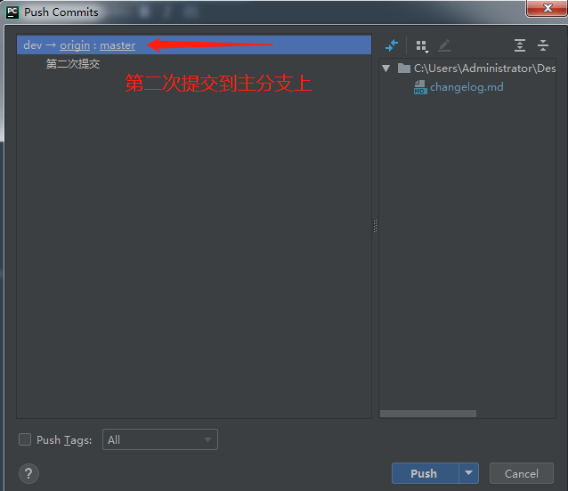

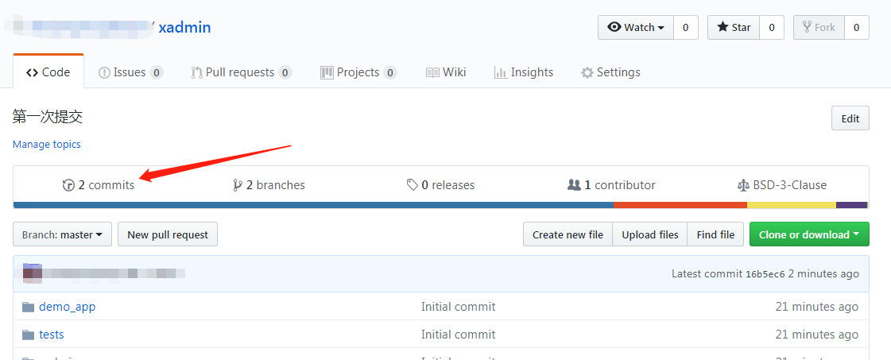

```
查看版本提交的历史
```

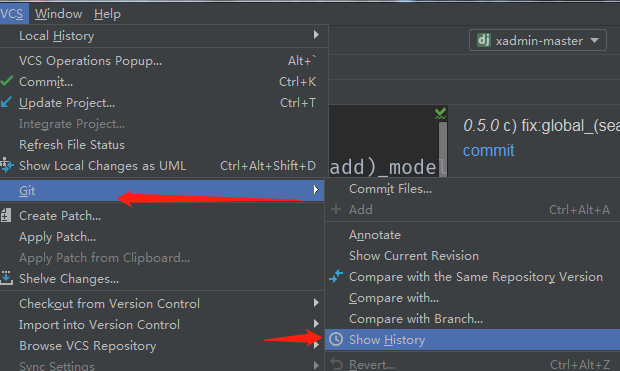
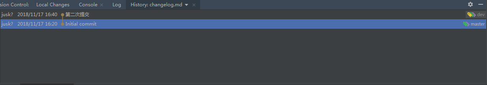

```
点进去你可以看到那次提交的与上一次的不同
```

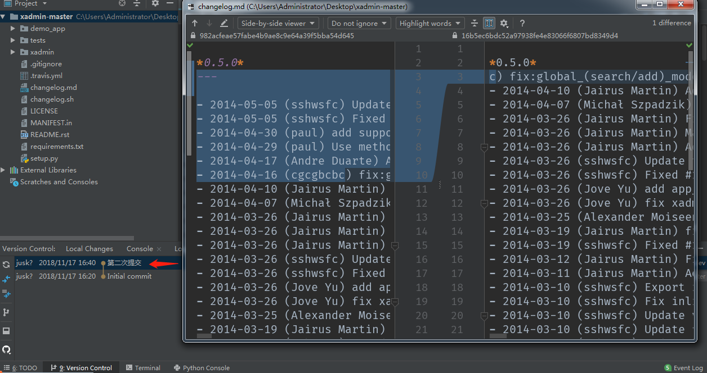

```
回到你想要提交的版本中
```
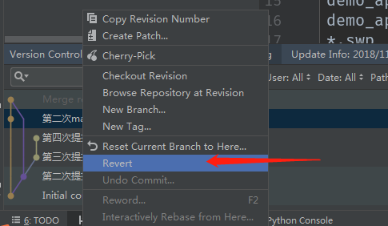
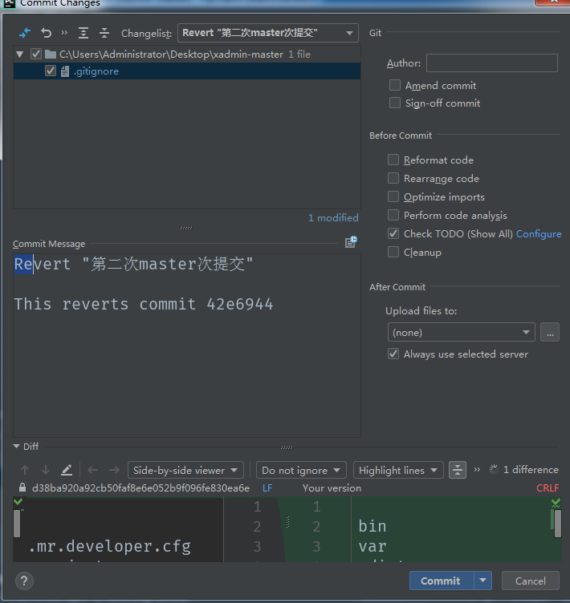


### **0x02 总结**
这次我们使用pycharm 做了git的常规操作
> 1、使用 pycharm 正常提交到github上
> 2、使用 pycharm 用到git做了分支操作，并且将分支提交到github
> 3、使用pycharm 用到git做到了查找历史所提交的各种版本
> 4、使用 pycharm 用到git做了版本回滚的操作，将代码回滚到原来的版本上


