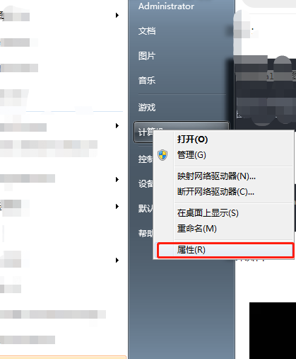
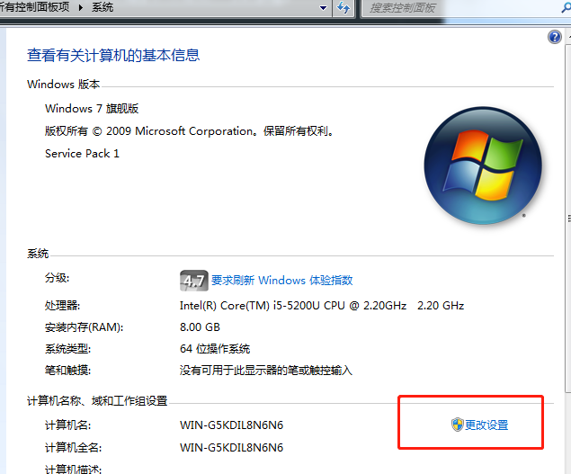

<!--more-->
### 前言
我的乖乖，我真的快崩溃了，用pycharm创建一个scrapy爬虫有这么难吗！我以为只是pip install scrapy就行了，配环境也是醉了，python太高也不行，出错，最后我下载anaconda也不行，难道网上的办法不行吗。没道理啊，坑都被踩过了，我应该不用担心的啊，但是还是掉坑里了，废了好大力气才爬上来。下面我来好好我遇到的坑。
### 0x00 环境

环境|版本|
--|:--:|
电脑|windows 7 专业版
IDE|Pycharm 2018.2.4|
集成环境|Anaconda3-2.1.0-Windows-x86_64.exe|

### 0x01 安装过程
我们先下在集成环境,下载Anaconda之前我们来了解下这东西的用途，其实他就是即python编译器和各种包于一体的东西，他的包含的包几乎包含了我们常用的所有包，但遗憾的是他没能包含scrapy,所以我们下载完之后还的手动下载scrapy。

好的。先我们先下载[Anaconda](https://mirrors.tuna.tsinghua.edu.cn/anaconda/archive/Anaconda3-2.1.0-Windows-x86_64.exe)，点击就直接下载了，用的是清华的源，下载速度那是非常的快，下载完正常的点击,正常安装，安装完之后我们的配置系统环境变量，

然后


继续


最后，将你安装的地址填如，比如我的是C:\Users\Administrator\Anaconda3\Scripts;


确定之后，就能正常使用Anaconda的自带命令了。

下面我们来安装一下scrapy，但是安装之前我们还是得解决下这个Anaconda的配置问题，用everthing查找.condarc配置文件
，点击用记事本打开
```
channels: 
    - https://mirrors.tuna.tsinghua.edu.cn/anaconda/pkgs/free/ 
    - defaults

show_channel_urls: yes
```

将上面的清华源的下载地址复制替换，因为这个源地址是国外的，可能要翻墙，但是仅翻墙还是不够的，我试着翻墙也解决不了直接安装scrapy的问题，真的，很诡异。网上搜索也是搜不出来，大家头铁的话可以试下，但是直接复制清华源这个默认配置，一切都OK。

下面打开Anaconda的命令行模式，直接输入

输入conda install scrapy  安装，
，回车安装，但是他会让你先安装一些依赖包，你看着直接输入y,安装就好了，因为是清华源所以只要你网速可以的话是一会就下载了的。

好的，接下来就是在Pycahrm的正常项目创建啥的了

第一创建一个项目


第二创建scrapy


可以看到旁边已经创建成功了，下面就可以我们的学习了。坑已经填了，下次我们拥抱liunx或苹果吧，这个配环境有点坑。

### 0x02 总结
这次我们入坑创建了scrapy，对以后的爬虫框架学习打下了基础，其实爬虫自己也学了一段时间，只是框架的利用会简化我们的编写步骤，提高爬虫效率。并不是就一定是为了一味的学习框架，这里我想说的是切勿追新下一些新的版本，或库，真的，多去网上看网友的经验，下一些稳定版本的东西，不然，网上很多资料都还没跟新，对底层不是很了解的话，解决问题会很困难。

