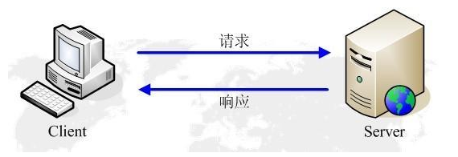
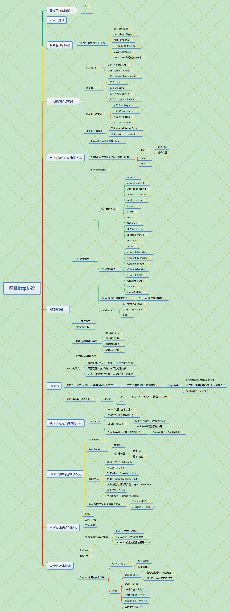

<!--more-->
## 简介下http协议

> 1、超文本传输协议（hyperText Transfer Protocol），是一种用于www服务器传输文本到本地浏览器的传输协议

### URI
> 1、URI:统一资源标识符，就是使用web浏览器访问web页面时需要输入的网页地址，比如：http：//www.baidu.com

> ftp://ftp.is.co.za等等

### URL
> 1、URL表示资源的地点，其实URL就是URI的子集

> 2、比如www.baidu.com/index/1.jpg标

## 简单的http协议
### 告知服务器意图的http方法
* get  获取资源
* > GET方法用来请求已被URI识别的资源

* > 指定的资源经服务器端解析后返回响应类容。

* > 也就是说，如果请求的资源是文本，那么就保持原样返回

* post 传输实体主体
* > post方法用来传输实体的主体

* > psot的功能与get很相似，但是post的主要目的并不是获取响应内容的主体内容

* PUT:  传输文件
* > PUT ：方法用来传输文件，就像FTP协议的文件上传一样，要求在保本的主体中包含文件的内容，然后保存到请求URL指定的位置

* HEAD: 获得报文首部
* > HEAD方法和GET方法一样，只是不返回报文主体部分，用于确定URI的有效性及资源更新的日期时间等

* DELETE:删除文件
* > DELETE方法用来删除文件，是与PUT相反的方法，DELETE方法按

* > 请求URI删除指定的资源。

* OPTIONS: 询问支持的方法
* > OPTIONS方法用来查询针对请求URI指定的资源支持的方法

## http响应的状态码
> 状态码的职责是当客户端向服务器端发送请求时，描述返回的请求的结果，借助状态码，用户可以知道服务端是正常处理了请求，还是出现了错误。

> 状态码的类别

### 2XX  成功
> 2XX的响应结果表明请求被正常处理了 

* 204  No content

* > 该状态码代表服务器接收的请求已成功处理，但是返回的响应报文中不含实体的主体部分

* 206  partial Content

* > 该状态码表示客户端进行了范围请求，尔服务器成功执行了这部分的GET请求，响应报文中包含content-Range指定范围的实体内容

### 3XX 重定向
> 3XX响应结果表明浏览器需要执行某些特殊的处理以正确的处理请求

* 301 Moved Permanently 

* > 永久性重定向。该状态码表示请求的资源已被分配新的URI，以后应使用资源现在所指的URI

* 302 Found

* > 临时性重定向。该状态吗表示请求的资源已被分配了新的URI,希望用户（本次）能使用新的URI访问

* 303 See Other

* > 该状态码表示由于请求对应的资源存在另一个URI,应使用GET方法定向获取请求的资源

* 304 Not Modified

* > 该状态码表示客户端发送附带条件的请求时  ，服务器端允许请求访问资源，但未满足条件的情况

* 307 Temporary Redirect
* > 临时重定向，该状态码与302 Found有着相同的含义，尽管302标准禁止POST变换成GET，但实际使用时大家并不会遵守

### 4XX 客户端错误
> 4XX的响应结果表明客户端是发生错误的原因所在

* 400 Bad Request

* > 该状态码表示请求报文中存在语法错误。当错误发生时，需修改请求的内容猴再次发送请求

* 401 Unauthorized

* > 该状态码表示发送的请求需要有偷偷拿过http认证（BASIC认证、DIGEST认证）的认证信息，另外若之前已经行过1次请求，则表示用户认证失败

* 403 Forbidden 

* > 该状态码表明对请求资源的访问被服务器拒绝了

* 404 Not Found

* > 该状态码表明服务器上无法找到请求的资源。

### 5XX  服务器错误
* 500 Internal Server Error

* > 该状态码表明服务器端在执行请求时发生了错误。也

* 503 Service Unavaliable

* > 该状态码表明服务器暂时处于超负荷或正在进行停机维护，现在无法处理

* > 请求。

## 与http协作的web服务器
### 用单台虚拟主机实现多个域名

> 如果一台服务器内托管了www.tricorder.jp和www.hackr.jp这两个域名，当收到请求时就需要弄清楚究竟要访问哪个域名

> 他们访问的ip地址会相同，在相同的ip地址下，由于虚拟主机可以寄存多个不同主机名和域名的web网站，因此在发送http请求时，必须在host首部内容完整指定主机名或域名的URO

### 通信数据转发程序：代理、网关、隧道
> HTTP通信时，除客户端和服务器以外，还有一些用通信数据转发的应用程序，例如代理、网关和隧道。他们可以配合服务器工作

* 代理

* > 代理服务器的基本行为就是接受客户端发送的请求后转发给其他服务器，代理不改变请求URI，会直接发送给前方持有资源的目标服务器

    * 缓存代理
    * 透明代理
* 网关

* > 网关的工作机制和代理十分相似，而网关能使通信线路上的服务器提供非HTTP协议服务

* 隧道

* > 隧道可按要求建立起一条与其他服务器的通信线路，届时使用SSL等加密手段进行通信，隧道的目的是确保客户端能与服务器进行通信

* > 隧道本身不会去解析http请求

### 保存资源的缓存

> 缓存服务器的优势在于利用缓存可以避免多次冲源服务器转发资源，因此客户端可就近从缓存服务器上获取资源，而源服务器也不必多次处理相同的请求

## HTTP首部

> http协议的请求和响应报文中必包含http首部。首部内容为客户端和服务器分别处理请求和响应提供所需要的信息。对于客户端影虎来说，这些信息的大部分内容都无法亲自查看

### http请求报文

> 在请求中，http报文由方法、URI、http版本、http首部字段等部分构成。

* 请求首部字段
* > 请求首部字段是从客户端往服务端发送请求报文中所使用的字段，用于补充请求的附加信息、客户端信息、对响应内容相关的内容
    * Accept

     * > Accept首部字段可通知服务器，用户代理能够处理的媒体类型及媒体类型的相对优先级。可使用type/subtype这种形式，一次指定多种媒体类型

    * Accept-Charset

     * > Accept-Charset  首部字段可用来通知服务器代理支持的字符串及字符集的相对优先顺序。

     * > 与首部字段Accept相同的是可用权重q值来表示相对优先级

    * Accept-Encoding
     * > Accept-Encoding首部字段来告知服务器用户代理支持的内容编码及内容编码的优先级顺序，可一次性指定多种内容编码 

     * > gzip

     * > compress

     * > deflate

     * > identity

    * Accept-language
     * > 首部字段Accept-language用来告知服务器用户代理能够处理的自然语言集（指中文或英文等），以及自然语言集的相对优先级
    * Authorization
     * > 首部字段Authorization是用来告知服务器，用户代理的认证信息（证书值）
    * Expect
     * > 客户端使用首部字段Expect来告知服务器，期待出现的某种特定行为
    * From
     * > 首部字段From用来告知服务器使用用户代理的用户的电子邮件地址。
    * Host
     * > 首部字段host会告知服务器，请求的资源所处的互联网主机名和端口号。
    * If-Match
     * > 形如If-xxx这种样式的请求首部字段，都可以称为条件请求
    * If-Modified-since
     * > 首部字段If-Modified-Since  属附带条件之一，他会告知服务器若If-Modified-Since字段值早于资源的更新时间，则希望能处理该请求。
    * If-None-Match
     * > 首部字段If-None-Match属于附带条件之一，它和首部字段If-match作用相反。
    * If-Range
     * > 首部字段If-Range属于附带条件之一，它告知服务器若指定的If-range字段值（ETag值或者时间）和请求资源的ETag值或时间相一致时，则作为范围请求处理。
* 实体首部字段
* > 实体首部字段是包含在请求报文和响应报文中的实体部分所使用的首部，用于补充内容的更新时间等与实体相关的信息
    * Allow
     * > 首部字段Allow用于通知客户端用来能够支持Requset-URI指定资源的所有HTTP方法
    * Content-Encoding
     * > 首部字段Content-Encoding会告知客户端服务器对实体的主体部门选用的内容编码方式
    * Content-Language
     * > 首部字段Content-Language会告知客户端，实体主体使用的自然语言（指中文或英文等语言）
    * Content-Length
     * > 首部字段Content-Length表明了实体主体部分的大小（单位是字节）
    * Content-Location
    * Content-MD5
     * > 首部字段Content-MD5是一串由MD5算法生成的值，其目的在于检查报文主体在传输过程中是否保持完整，以及确认传输到达。
    * Content-Range
     * > 针对范围请求，返回响应时使用的首部字段Content-Range,能告知客户端
     * > 作为响应返回的实体的哪个整体部分符合范围请求
    * Expires
     * > 首部字段Expires会将资源失效的日期告知客户端。
    * Last-Modified
     * > 首部字段last-Modified指明资源最终修改的时间
* 为Cookie服务的首部字段
    * Set-Cookie字段的属性
* 其他首部字段
    * X-Frame-Options
     * > 首部字段X-Frame-Options属于HTTP响应首部，用于控制网络网络内容在其他Web网站的Frame标签内的显示问题。
    * X-XSS-Protection
     * > 首部字段X-XSS-Protection属于HTTP响应首部，他是针对跨站脚本攻击（XSS）的一种对策，用于控制浏览器XSS保护机制的开关
    * P3P
     * > 首部字段跑p3p属于HTTP相应首部，通过利用p3p,可以让web网站上的个人隐私变成一种仅供程序可理解的形式，以达到保护用户隐私的目的
### HTTP响应报文
> 在响应中，http报文由http版本、状态码（数字和原因短语）、http首部字段3部分构成
### http首部字段
> 使用首部字段是为了给浏览器和服务器提供报文主体大小，所使用的语言、认证信息等内容。
### 4种http首部字段类型
* 通用首部字段
* > 请求报文和响应报文两方都会使用的首部
* 请求首部字段
* > 从客户端向服务器端发送请求报文时使用的首部
* > 补充了请求的附加内容、客户端信息、响应内容相关优先级等信息
* 响应首部字段
* > 从服务器端向客户端返回响应报文时使用的首部
* > 补充了响应的附加内容、也会要求客户端附加额外的内容信息
* 实体首部字段
* > 针对请求报文和响应报文的实体部分使用的首部。补充了资源内容更新时间等与实体相关的信息
### 非http/1.1首部字段
> 在http协议通信交互中使用到的http首部字段，不限于RFC2016中定义的47种首部字段
> 还有cookie、set-cookie和content-disposition等在其他RFC中定义的首部字段，他们的使用频率也很高。
## HTTPS
### HTTP的缺点
* 通信使用的明文（不加密），内容可能会被监听
* 不验证通信方的身份，有可能遭遇伪装
* 无法证明报文的完整性，所以有可能已遭篡改
### HTTP  + 加密  + 认证  + 完整性保护=HTTPS
* HTTPS是身披SSL外壳的HTTP
    * https缺点
        * https要比http要慢2-100倍
        * 占资源，耗费服务器CPU以及内存资源
        * 要购买证书、要花费钱
### HTTPS的安全通信机制
* 加密协议
    * SSL
        * 缺点：HTTPS比HTTP要慢2-100倍
    * TLS
## 确定访问用户身份的认证
### 认证方式
* BASIC认证（基本认证） 
* > 是web服务器与通信客户端吧之间的认证方式
* DIGEST认证（摘要认证）
* > 弥补BASIC认证存在的弱点，使用质询/响应的方式
* SSL客户端认证
* > 从使用用户ID和密码的认证方面来说，只要二者的内容正确，即可认证是本人的行为。
    * SSL客户端认证采用双因素认证
    * SSL客户端认证必要的费用
* FormBase认证（基于表单认证）
* > 基于表单的认证方法并不是在HTTP协议中定义的，客户端会向服务器上的Web应用程序发送登录信息，按登录信息的验证结果认证
    * Session管理及Cookie应用
     * > 鉴于http是无状态协议，之前已认证成功的用户状态，即无法实现状态管理，因此即使该用户下次继续访问，也可以区分他和其他的用户，于是我们会使用Cookie来管理Session，以弥补HTTP协议中不存在的管理功能
## HTTP的功能追加的协议
### Goole:SPDY
### WebSocket
> 使用浏览器进行全双工通信的WebSocket
* 推送功能
* 减少通信量
    * 握手*请求
    * 握手*响应
### HTTP/2.0
* 压缩：SPDY、Fridendly
* 多路复用：SPDY
* TLS义务化：Speed+Mobility
* 协商：Speed+Mobility,Friedly
* 客户端拉拽/服务器推送： Speed+Mobility
* 流量控制： SPDY
* WebSocket  : Speed+Mobility
### WebDAV:Web服务器管理文件
> 基于万维网的分布式创作和版本控制
> 是一个可对web服务器上的内容直接进行文件复制、编辑等操作的分布式文件系统
* WebDAV扩展
* 新增方法及状态码
    * 方法
        * PROPEIND:获得属性
        * PROPPATCH:修改属性
        * MKCOL:创建资源及属性
        * COPY:复制资源及属性
        * MOVE:移动资源
        * LOCK:资源加锁
        * UNLOCK:资源解锁
    * 状态码
        * 102  Processing
         * > 可正常处理请求，但目前是处理中状态
        * 207  Multi-Status
         * > 存在多种状态
        * 422  Unprocessible Entity
         * > 格式正确，内容有误
        * 423  Locked
         * > 资源已被加锁
        * 424 Failed Dependency
         * > 处理与某请求关联的请求失败，因此
         * > 不在保持依赖关系
        * 507 Insufficient Storage
         * > 保存空间不足
## 构建Web内容的技术
### HTML
### 动态HTML
### Web应用
### 数据发布的格式及语言
    * XML:可扩展标记语言
    * RSS/Atom：发布更新信息
    * javascript衍生的轻量级易用JSON
## Web的攻击技术
### 主动攻击
> 主动攻击：是指攻击者通过直接访问web应用
> 代表攻击有：SQL注入攻击、OS命令注入攻击
### 被动攻击
> 是指利用圈套策略执行攻击代码的攻击模式
> 被动攻击模式中具有代表性的攻击是跨站脚本攻击和跨站点请求伪装
### 实施web应用的安全对策
* 客户端的验证
    * 输入值验证
    * 输出值转义
* 攻击
    * 跨站脚本攻击
        * 在动态生成HTML处发送
        * 对用户Cookie的窃取攻击
    * SQL注入攻击
    * OS命令注入攻击
    * HTTP首部注入攻击
    * 邮箱首部注入攻击
    * 目录便利攻击

资料 百度网盘 链接: https://pan.baidu.com/s/1C_uaSkPXf_8UZJVFhF5x2A 提取码: b5i2 