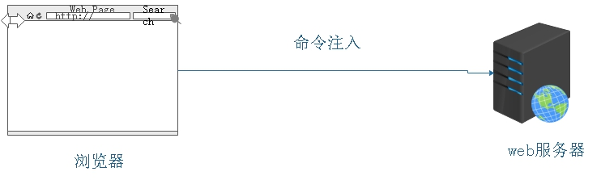
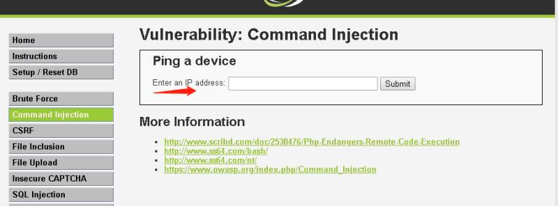
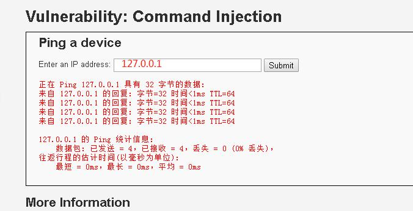
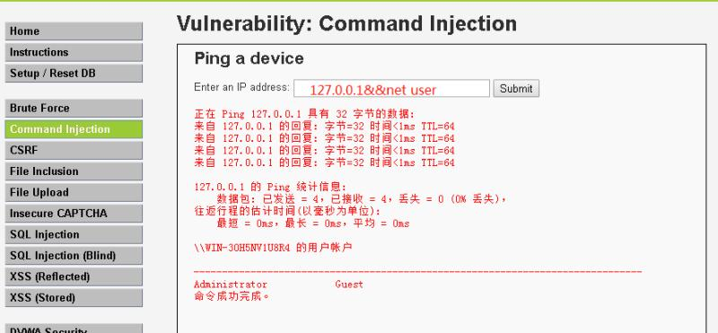
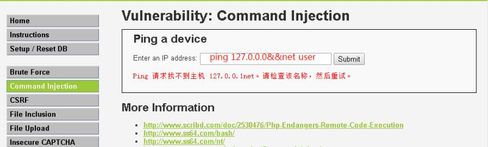
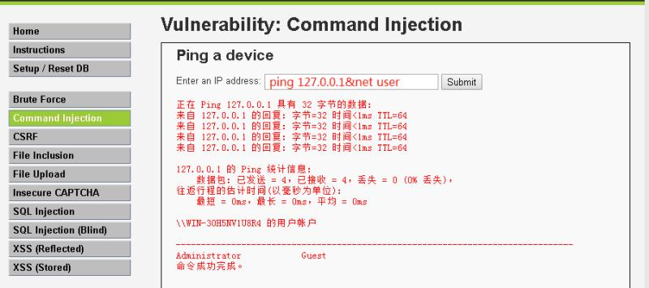
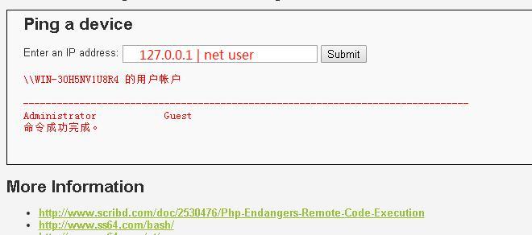
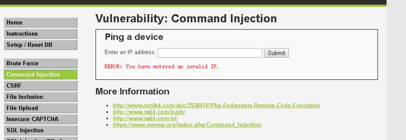

<!--more-->

### **0x00 前言**
这次我们讲下命令注入,由于没有过滤很多字符，导致在开发者本来只允许调用的系统命令，让某些别有用心的人发现漏洞后直接调用其他系统命令，直接控制电脑的行为。


### **0x01 开始实验**
这次没有基本知识，都是些浅而易见的知识

#### low等级
我们看下源码
```
Command Injection Source
<?php 

if( isset( $_POST[ 'Submit' ]  ) ) { 
    // Check Anti-CSRF token 
    checkToken( $_REQUEST[ 'user_token' ], $_SESSION[ 'session_token' ], 'index.php' ); 

    // Get input 
    $target = $_REQUEST[ 'ip' ]; 
    $target = stripslashes( $target ); 

    // Split the IP into 4 octects 
    $octet = explode( ".", $target ); 

    // Check IF each octet is an integer 
    if( ( is_numeric( $octet[0] ) ) && ( is_numeric( $octet[1] ) ) && ( is_numeric( $octet[2] ) ) && ( is_numeric( $octet[3] ) ) && ( sizeof( $octet ) == 4 ) ) {
        // If all 4 octets are int's put the IP back together. 
        $target = $octet[0] . '.' . $octet[1] . '.' . $octet[2] . '.' . $octet[3]; 

        // Determine OS and execute the ping command. 
        if( stristr( php_uname( 's' ), 'Windows NT' ) ) { 
            // Windows 
            $cmd = shell_exec( 'ping  ' . $target ); 
        } 
        else { 
            // *nix 
            $cmd = shell_exec( 'ping  -c 4 ' . $target ); 
        } 

        // Feedback for the end user 
        echo "<pre>{$cmd}</pre>"; 
    } 
    else { 
        // Ops. Let the user name theres a mistake 
        echo '<pre>ERROR: You have entered an invalid IP.</pre>'; 
    } 
} 

// Generate Anti-CSRF token 
generateSessionToken(); 

?> 
```
无任何过滤，直接调用系统ping命令，我们试下看





先解释下这条命令什么意思，就是先执行ping 127.0.0.1,然后执行net user(查看当前用户的名称),还有许多像这样的字符可以利用
```
命令一&&命令二     先执行命令一，然后执行命令二
命令一&命令二      先执行命令一，然后执行命令二，但是命令一不管有没有成功，都会执行命令二
命令一|命令二      前者处理的结果作为参数传给后者，只执行命令二
```

他执行了这种不是开发者想要执行的命令，如果他把一下cmd下的恶意命令也执行的话，后果不堪设想


#### medium 等级
我们还是看下源码
```
Command Injection Source
<?php 

if( isset( $_POST[ 'Submit' ]  ) ) { 
    // Get input 
    $target = $_REQUEST[ 'ip' ]; 

    // Set blacklist 
    $substitutions = array( 
        '&&' => '', 
        ';'  => '', 
    ); 

    // Remove any of the charactars in the array (blacklist). 
    $target = str_replace( array_keys( $substitutions ), $substitutions, $target );

    // Determine OS and execute the ping command. 
    if( stristr( php_uname( 's' ), 'Windows NT' ) ) { 
        // Windows 
        $cmd = shell_exec( 'ping  ' . $target ); 
    } 
    else { 
        // *nix 
        $cmd = shell_exec( 'ping  -c 4 ' . $target ); 
    } 

    // Feedback for the end user 
    echo "<pre>{$cmd}</pre>"; 
} 

?> 
```

我们可以看到只是把&&命令和;过滤，但这样并没有什么用，我们看操作
原来的命令没用了


但是这个直接绕过

上面我们这个命令先执行命令一，在执行命令二，不管命令一有没有执行成功


#### hign 等级

看下代码
```
Command Injection Source
<?php 

if( isset( $_POST[ 'Submit' ]  ) ) { 
    // Get input 
    $target = trim($_REQUEST[ 'ip' ]); 

    // Set blacklist 
    $substitutions = array( 
        '&'  => '', 
        ';'  => '', 
        '| ' => '', 
        '-'  => '', 
        '$'  => '', 
        '('  => '', 
        ')'  => '', 
        '`'  => '', 
        '||' => '', 
    ); 

    // Remove any of the charactars in the array (blacklist). 
    $target = str_replace( array_keys( $substitutions ), $substitutions, $target );

    // Determine OS and execute the ping command. 
    if( stristr( php_uname( 's' ), 'Windows NT' ) ) { 
        // Windows 
        $cmd = shell_exec( 'ping  ' . $target ); 
    } 
    else { 
        // *nix 
        $cmd = shell_exec( 'ping  -c 4 ' . $target ); 
    } 

    // Feedback for the end user 
    echo "<pre>{$cmd}</pre>"; 
} 

?> 
```
这种方法只是把设置黑名单的方式去书写代码，把几乎所有字符都替换成了空字符，如&，&&，||，|等，但是他的 | 后面有空格，还是给了| 管道符大显神通的作用。



解释下  "|" 管道符，linux上是让左边的输出就会作为管道符右边命令的输入。举个例子
```
cat /etc/passwd | grep /bin/bash | wc -l
这条命令使用了两个管道，利用第一个管道将cat命令（显示passwd文件的内容）的输出送给grep命令，grep命令找出含有“/bin /bash”的所有行；第二个管道将grep的输出送给wc命令，wc命令统计出输入中的行数。这个命令的功能在于找出系统中有多少个用户使用bash
```

```
ping 127.0.0.1 | net user
前者处理的结果作为参数传给后者
```

#### impossible 等级

看下源代码
```
Command Injection Source
<?php 

if( isset( $_POST[ 'Submit' ]  ) ) { 
    // Check Anti-CSRF token 
    checkToken( $_REQUEST[ 'user_token' ], $_SESSION[ 'session_token' ], 'index.php' ); 

    // Get input 
    $target = $_REQUEST[ 'ip' ]; 
    $target = stripslashes( $target ); 

    // Split the IP into 4 octects 
    $octet = explode( ".", $target ); 

    // Check IF each octet is an integer 
    if( ( is_numeric( $octet[0] ) ) && ( is_numeric( $octet[1] ) ) && ( is_numeric( $octet[2] ) ) && ( is_numeric( $octet[3] ) ) && ( sizeof( $octet ) == 4 ) ) {
        // If all 4 octets are int's put the IP back together. 
        $target = $octet[0] . '.' . $octet[1] . '.' . $octet[2] . '.' . $octet[3]; 

        // Determine OS and execute the ping command. 
        if( stristr( php_uname( 's' ), 'Windows NT' ) ) { 
            // Windows 
            $cmd = shell_exec( 'ping  ' . $target ); 
        } 
        else { 
            // *nix 
            $cmd = shell_exec( 'ping  -c 4 ' . $target ); 
        } 

        // Feedback for the end user 
        echo "<pre>{$cmd}</pre>"; 
    } 
    else { 
        // Ops. Let the user name theres a mistake 
        echo '<pre>ERROR: You have entered an invalid IP.</pre>'; 
    } 
} 

// Generate Anti-CSRF token 
generateSessionToken(); 

?> 
```


stripslashes()函数，去除字符串中的反斜杠，反转义。还加了Generate Anti-CSRF token ,跨站请求伪造防护，这样防止了盗取cookie来进行利用。


### **0x02 总结**
好的，又到了一年一度的总结时刻，我们这次讲的是命令注入，开发者没有在有的地方进行用户的输入过滤，导致
利用一些命令直接达到控制电脑，窃取用户的信息。
这次我们讲了三种等级以及三种等级如何绕过的方式。最后在impossible的时候，看下别人是如何进行有效的防护的。


