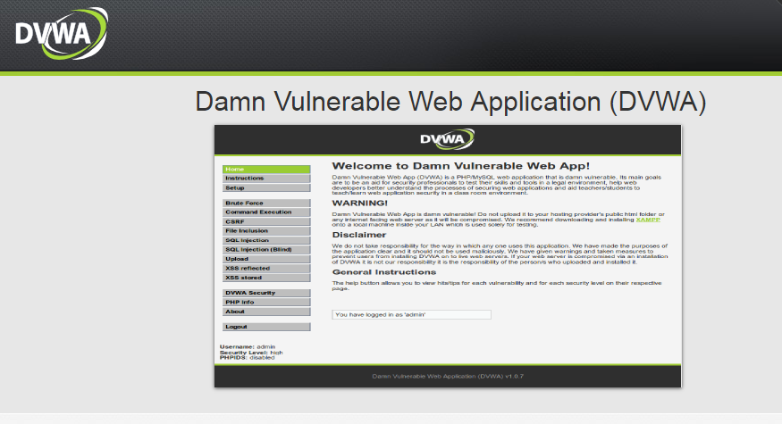
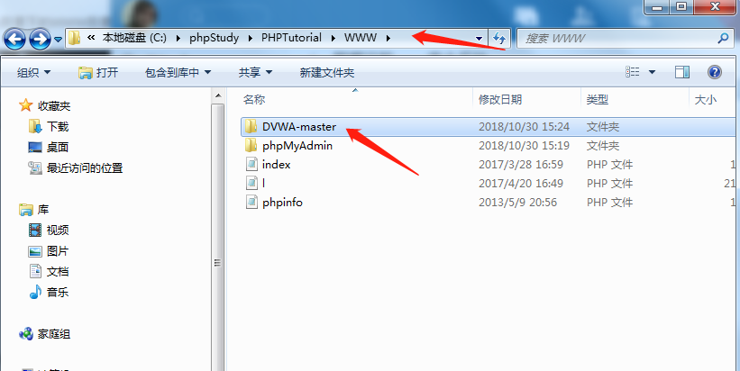
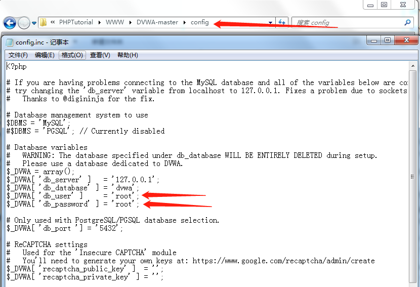
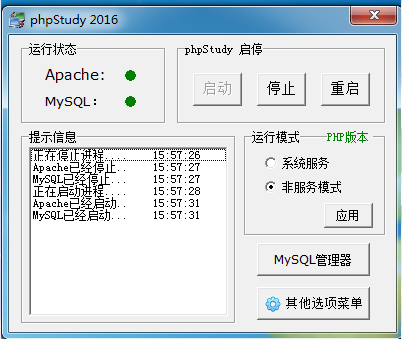
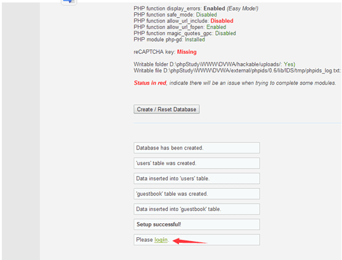
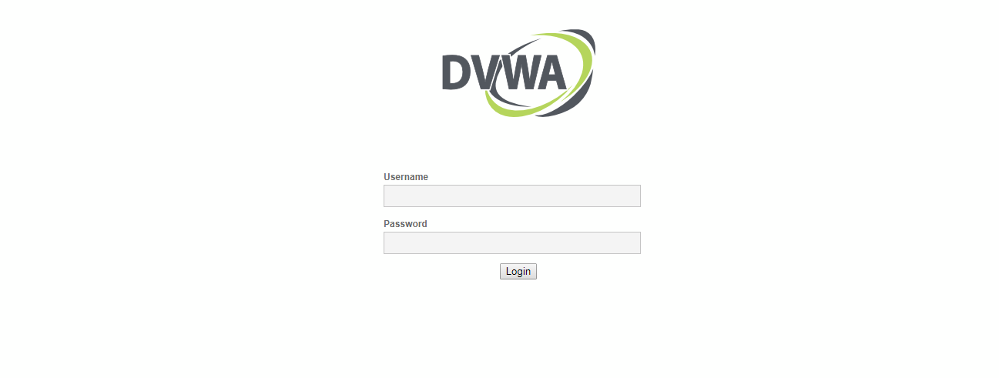
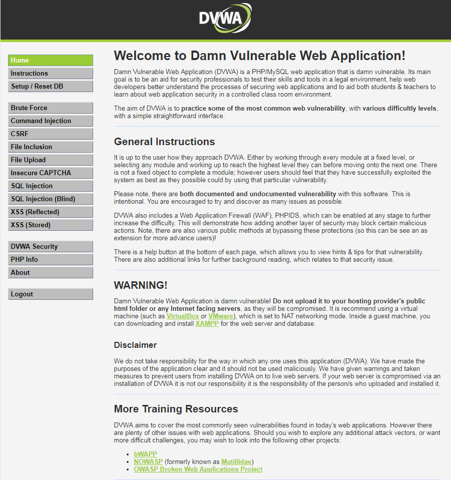

<!--more-->

### **0x00 前言**

前面稍微讲解了下htttp协议，有兴趣的话可以去读一下《图解http协议》《http权威指南》，里面有详细的讲解.

陆游说"纸上得来终觉浅 绝知此事要躬行",告诉我们重要的是需要将了解的东西应用到实战中。下面介绍的是dvwa环境搭建，有讲的不好的地方多多包涵。
### **0x01 环境介绍**
 > 先来介绍下dvwa

 DVWA（Damn Vulnerable Web Application）是一个用来进行安全脆弱性鉴定的PHP/MySQL Web应用，旨在为安全专业人员测试自己的专业技能和工具提供合法的环境，帮助web开发者更好的理解web应用安全防范的过程。

 > 再来介绍下phpstudy

 phpStudy是一个PHP调试环境的程序集成包。
### **0x03 搭建步骤**

 > 将dvwa解压到phpstudy 目录下的www目录



> 修改DVWA-master\config



> 开启phpstudy

如果之前有mysql,并有密码，在设置dvwa的config的时候，需要将数据库密码设置成你设置过的




> 访问http://127.0.0.1/DVWA-master/setup.php,点击login



> 接下来输入账号和密码，默认为 admin password



> 成功登录




### **0x04 dvwa漏洞列表**
```
Brute Force（暴力（破解））

Command Injection（命令行注入）

CSRF（跨站请求伪造）

File Inclusion（文件包含）

File Upload（文件上传）

Insecure CAPTCHA （不安全的验证码）

SQL Injection（SQL注入）

SQL Injection（Blind）（SQL盲注）

XSS（Reflected）（反射型跨站脚本）

XSS（Stored）（存储型跨站脚本）

```

### **0x05 dvwa漏洞等级**
```
Low

Medium

High

Impossible
```

### **0x06 总结**
这次简单介绍了phpstudy以及dvwa,以及搭建的详细步骤。当然还介绍dvwa里面的各类型漏洞，下面我们将以攻击者的角度来攻击dvwa搭建的网站


