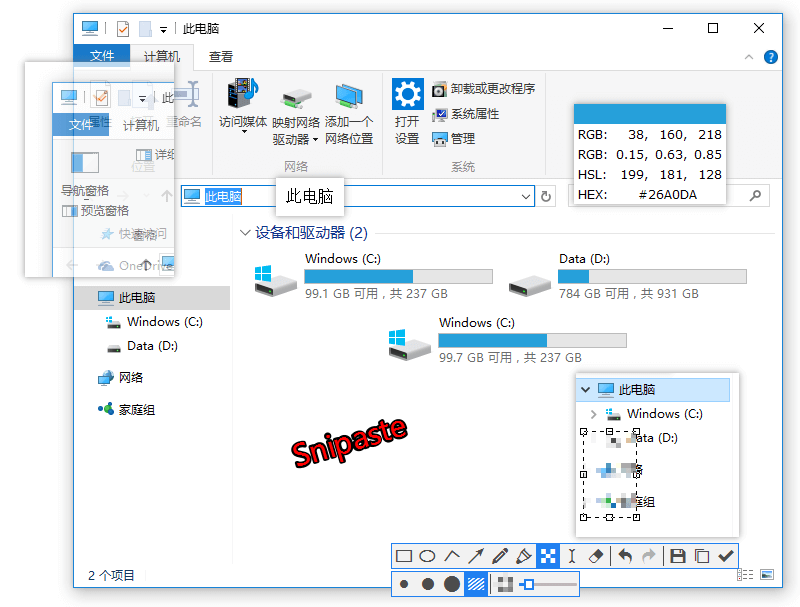
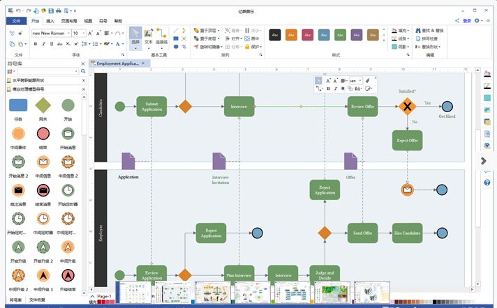

<!--more-->

## 安装系统
### [Rufus](http://rufus.akeo.ie/?locale=zh_CN)
* 小巧简单的引导盘烧制工具，你能想到几百k的东西能那么强大

### 老毛桃
* 功能强大，简单易用

## 在线免费转文件格式

### [SmallPDF](https://smallpdf.com/)
* 遗憾的是只能转几次

### 迅捷PDF转换器
* 就是只能转小文件，其他还好

## GIF工具
### Screen to GIF
* 占用空间小，十分便携

### GifCam
* 通过将软件置顶在所有窗口之上，你可以像相机一样调整录制区域，移动或缩放窗口。

## 听歌软件
### 网易云音乐
* 文艺青年聚集地，吸多了就免疫了

### [插件Listen 1](https://github.com/listen1/listen1_chrome_extension)
* 很多要版权的都可以听吧。缺点就是占内存吧

### QQ音乐
* 腾讯还是爸爸

## 系统管理工具  win
### 微软Sysinternals系统工具包
> Sysinternals疑难解答实用程序已经卷入单一套工具。此文件包含各个故障排除工具和帮助文件。它不包含非故障排除工具，如BSOD屏幕保护程序或NotMyFault

### 文件搜索工具
* Everything
    * 神器搜索，懂就行了

* Listary
* > Listary，双击ctrl键即可弹出检索框，输入文字即可检索相关的内容并打开，非常快捷，整个用时也不会超过5秒。

    * 看你个人使用习惯

### 垃圾清理工具
* CCleaner
    * 占内存小，如果不喜欢360就用这个吧

### 杀毒保护工具
* 360杀毒
    * 现在就用这个吧。其他不知道，懒得去用

### 屏幕亮度调节工具
* f.lux
    * 用了很久，没啥效果，不知道是不是吹出来的

### U盘拔出工具
* unlocker
    * 总有些进程不老实

### 截图神器
* Snipaste
* > 专注截图功能，滚动截图，截长图.
我一般现在只用qq截屏和360浏览器的自带截图功能,
 qq和微信用的多了，基本不太用

    
    
### ppt演示神器
* Zoomit
* > 下载ZoomIt后，打开即可使用。打开时，你会看到几个页面，这几个页面是为了介绍每个功能的使用，还可以去设定你觉得比较舒服的快捷键，默认的是 Ctrl+1 屏幕放大、Ctrl+2 屏幕标注，Ctrl+3 计时器。不用管他，叉掉就好，它会在右下角的icon处默默运行的~
* > 按住Shift键可以画出直线；
* > 按住Ctrl键可以画出矩形；
* > 按住tab键可以画出椭圆形；
* > 按住shift+ctrl 可以画出箭头。

### 文件恢复软件
* Recuva

### 视频播放软件
* PotPlayerMini.e
    * 界面美观，解码功能都强大，占内存小

### 输入法软件
* 搜狗输入法
    * 跨平台、中了他的毒，出不来了

### dns切换软件
* DnsJumper
    * 切换到延迟最低的dns上，现在dns污染太严重了

## 下载软件
### 视频下载
* 硕鼠
    * 基本懒的用了，懒得下视频了，哈哈

### 百度云
* 百度云官方客户端
    * 用着呗。上传啥的

* PanDownload
    * 强大，简单、易用

* [ JDownloader2 ](http://jdownloader.org/)
    * 强大、简单、一般的网页上的视频都能嗅探出来

### 迅雷
* 迅雷极,还是好用的啊,但是用网盘用多了，就用的少了

### 文库下载
* 冰点文库：iDocDown
* > 很多时候百度要下载一些百度文库和其他文库之类的东西   这个软件就能下载

    * 百度文库下载，强大，但是慢慢发现很多缺点。

## 浏览器
### 360浏览器
* 很适合我们的使用习惯，插件也很多的

### 谷歌浏览器
* 跨平台性极好，同步性也好，目前常用的就这个

* 谷歌插件
    * 脚本插件Tampermonkey
        * 可以发现很多厉害的脚本功能
    * 屏蔽广告
        * [AdBlock](http://dwz.cn/fjr47)
    * 印象笔记*剪裁
    * SwitchyOmega
        * 配合一些软件代理比较方便

### Firefox浏览器
* 和谷歌一样跨平台也好，同步性也好

* firefox插件
    * 谷歌上的插件基本有
    * hackbar
        * 基本测试插件吧

## 笔记
### 印象笔记
* 目前在用的一款软件。习惯了，比较好用就行

### xmind
* 脑图，这个笔记就是这个画的，当然弃坑去wps画我觉得也是可以的

## 科学上网
### shadowsocks
* 开源和应用性比较好的软件，相对成熟，但随着。。。

### [Brook](https://github.com/txthinking/brook)
* 开源和跨平台比较好的代理软件、项目不算很成熟，偶尔掉线

## 编程软件
### VS Code
* 编辑器，开源，跨平台极好，用着几乎不卡，插件也丰富

* 插件
    * vscode-icons
        * 这是一个能够在项目中添加图标字体的插件
    * HTML CSS Support
        * 智能提示
    * open in browser
        * 打开浏览器
    * ESLint
        * 是用来统一JavaScript代码风格的工具
    * Debugger for Chrome
        * 谷歌浏览器调试
    * Chinese (Simplified) Language
        * 中文，其实看多了就那中英文都差不多
    * Browsersync
        * 能让浏览器实时、快速响应您的文件更改（html、js、css、sass、less等）并自动刷新页面
            * 也就是让你写页面能所见即所得,同步到浏览器
    * Bootstrap 3 Snippets
        * bootstrap快捷键，有了它，按几个键就能打出吧想要的东西
    * Auto Close Tag
        * 自动闭合标记
    * Python
        * 个人觉得不太好用，但是使用看个人习惯

### Pycharm
* IDE，画面美。如果写python的话，用着舒服，缺点就是你懂得，ide通病

### visual studio
* 神器，不太多用了，可能我太小白，编译一次卡一年

### git
* 版本控制、有了他，你懂得，效率高

## 远程软件
### windows-->linux
* xshell
    * 现在一般用这个，后门啥的，注意用下哈勃测下。挺好用的

* putty
    * 小巧玲珑，开源，用的不多

        

### 远程控制
* teamviewer
    * 跨平台，用了你就知道牛不牛逼

## 多屏，鼠标
### 共享鼠标键盘
* Mouse without Borders(无界鼠标)
    * 蛮好用的，缺点就是windows上玩

* synergy
    * 开源、跨平台、就是收费贵点，但是都懂的

* shareMouse
    * 跨平台，能拖文件啊

### PC--ipad 屏幕
* duet
    * 占内存小，几乎没有延迟，好用，缺点就是还得弄根线，就不能无线？

## 渗透测试
### 抓包
* wireshark
    * 对网络的七层都抓、功能强大，分析网络问题极有帮助

* fidder
    * web抓包，http,小巧精悍，小提琴还是稳的啊

### 注入
* sqlmap
    * 这得吹吧，开源、免费，还有很多temper 绕WAF脚本

### 扫描
* nmap
    * 端口扫描，还有几百个脚本配合

* 御剑
    * 别打我，小站也还是挺猛的

### 集成
* burpsuit
    * 抓包、截包、改包，漏扫，功能强大，使用简单，不止http协议抓哦

## win 解压工具
### RAR
* win 解压神器，还是那句话，习惯了

### 7.zip
* 开源、免费,压缩是真的强

## 办公软件
### office
* word,excel,ppt三件套，使用不多，不予评价，但是ppt你值得掌握

### 画图
* 亿图
    * 跨平台、很多靓丽的图，很多问题还是画出来吧

* visio
    * 专业一点的画图，主要是用它来画网络拓扑，缺点就是跨不了平台

### wps
* word,excel,ppt.现在自己用这个款，大部分功能也不常用，个人感觉还是好用的

## 游戏
### 魔兽争霸
* 稳稳的啊，操作强度有点大，现在看的多点，信仰还是要有的

