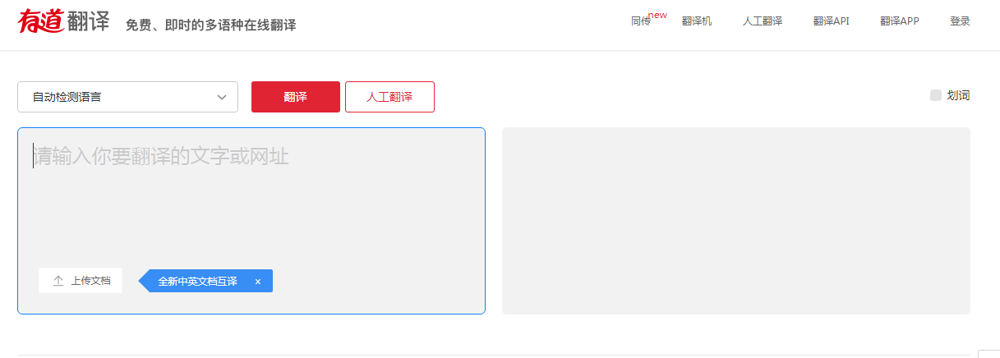
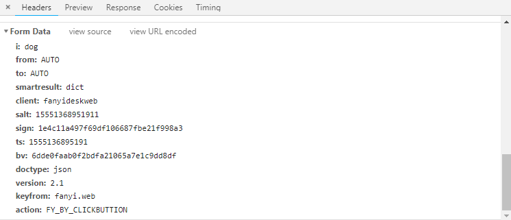
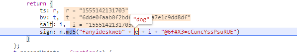

<!--more-->


谷歌浏览器中ctrl+shilt+f    是全局搜索
ctrl+f                      是当前文件夹下搜索

```
i: dog
from: AUTO
to: AUTO
smartresult: dict
client: fanyideskweb
salt: 15551412876771
sign: efd6e4b79562ad26b450b343afe25501
ts: 1555141287677
bv: 6dde0faab0f2bdfa21065a7e1c9dd8df
doctype: json
version: 2.1
keyfrom: fanyi.web
action: FY_BY_REALTlME
```

这里我们如果我们直接salt,sign, ts ,bv的值，那么我们就可以了

```
var r = function(e) {
    var t = n.md5(navigator.appVersion)
        , r = "" + (new Date).getTime()
        , i = r + parseInt(10 * Math.random(), 10);
    return {
        ts: r,
        bv: t,
        salt: i,
        sign: n.md5("fanyideskweb" + e + i + "@6f#X3=cCuncYssPsuRUE")
    }
};
```

我们可以清楚的知道return 已经将这几个值返回来了，我们也可以知道==r==的加密方法

```
r = "" + (new Date).getTime()
```


```
t = n.md5(navigator.appVersion)         #将当前浏览器md5加密
```


```
i = r + parseInt(10 * Math.random(), 10);
```

当然最难的是sign加密了

```
sign: n.md5("fanyideskweb" + e + i + "@6f#X3=cCuncYssPsuRUE")
```

这里加了个e,我们得想想这个e是什么了，e可以看到这样函数中传过来的值
直接打上断点
```
function(e) {
}
```


哦哦，我们知道了其实e的值就是我们传入的值，这样我们就知道他的规律了
```
ts : r = "" + (new Date).getTime()

bv ：t = n.md5(navigator.appVersion)         #将当前浏览器md5加密

salt : i = r + parseInt(10 * Math.random(), 10);

sign ： n.md5("fanyideskweb" + e + i + "@6f#X3=cCuncYssPsuRUE")     #e为传入的值

```

完美，直接上代码吧。

调试过程中发现一些加密字段没什么鬼用。坑比

```
import requests
import time
import random
import hashlib
headers = {
    "Host": "fanyi.youdao.com",
    "Connection": "keep-alive",
    "Content-Length": "236",
    "Accept": "application/json, text/javascript, */*; q=0.01",
    "Origin": "http://fanyi.youdao.com",
    "X-Requested-With": "XMLHttpRequest",
    "User-Agent": "Mozilla/5.0 (Windows NT 6.1; Win64; x64) AppleWebKit/537.36 (KHTML, like Gecko) Chrome/72.0.3626.119 Safari/537.36",
    "DNT": "1",
    "Content-Type": "application/x-www-form-urlencoded; charset=UTF-8",
    "Referer": "http://fanyi.youdao.com/",
    "Accept-Encoding": "gzip, deflate",
    "Accept-Language": "zh-CN,zh;q=0.9,en;q=0.8",
    "Cookie": "OUTFOX_SEARCH_USER_ID_NCOO=56338450.16575574; OUTFOX_SEARCH_USER_ID=-744237137@10.169.0.83; JSESSIONID=aaaIWa-5cAq5Of1zoyvOw; ___rl__test__cookies=1555137597319",

}


data = {
    'client': 'fanyideskweb',
    'i': 'look',
    'keyfrom': 'fanyi.web',
    'salt': '1540087006029',
    'sign': '675f5b51df2c8db9a12fe102f3355277',
}

url = "http://fanyi.youdao.com/translate_o?smartresult=dict&smartresult=rule"
e = input('请输入单词>>')
t = str(time.time()*1000 + random.randint(1, 10))
tmp = 'fanyideskweb' + e + t + '6x(ZHw]mwzX#u0V7@yfwK'
sign = hashlib.md5(tmp.encode('utf-8')).hexdigest()

data['i'] = e
data['salt'] = t
data['sign'] = sign

res = requests.post(url, headers=headers, data=data)

print(res.text)
```


结果：

```
{"translateResult":[[{"tgt":"狗","src":"dog"}]],"errorCode":0,"type":"en2zh-CHS","smartResult":{"entries":["","n. 狗；卑鄙的人；(俚)朋友\r\n","vt. 跟踪；尾随\r\n"],"type":1}}
```

就这样吗。步步，这样我们还得将js加密转换为python加密发过去，我们能不能有个简单的方法实现这个过程。有的

[execjs](https://xingzx.org/blog/eval-js-in-python)

这个库可以让我们直接在python环境下执行js代码
因为这个加密还是比较简单，所以就没必要用库了，直接python换算一下就行了


